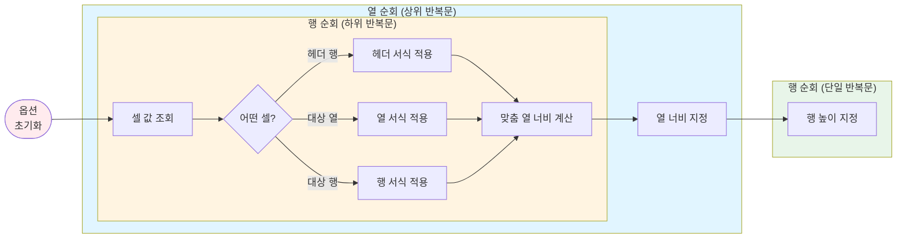



{}
<i class="icon-magic"></i> **AI 요약 & 가이드**

OpenPyXL의 개별 기능들을 통합하여 데이터 처리부터 스타일 적용까지 한 번에 처리하는
범용 엑셀 변환 함수를 구현합니다.
통합 함수를 통해 CSV 또는 JSON 데이터를 바로 엑셀 리포트로 변환할 수 있습니다.

- **[워크시트 작성하기](#데이터를-워크시트에-작성하기)**: `rows2sheet()` 함수 - 데이터 변환 후 시트 생성 및 서식 호출
- **[서식 적용하기](#순차적으로-서식-적용하기)**: `style_sheet()` 함수 - Mermaid 흐름도로 보는 순차적 처리 과정
- **[엑셀 변환 함수 구현하기](#엑셀-변환-함수-구현하기)**: `csv2excel()` / `json2excel()` 함수 - 여러 개 시트 지원, 필터 적용
- **[활용 예제](#엑셀-변환-함수-활용-예제)**: 샘플 데이터에 조건부 서식, 병합, 필터를 한 번에 적용
{}

이전 글 [파이썬으로 엑셀 다루기](/blog/openpyxl-styles/)에서
OpenPyXL로 엑셀 파일의 셀 서식, 조건부 서식, 셀 병합, 필터 기능을 사용하는 방법을 다뤘습니다.

하지만, 실무에서는 이러한 기능들을 매번 개별적으로 호출하는 것이 번거롭습니다.
데이터를 수집하고 가공한 후, 엑셀 파일로 변환하면서 동시에 스타일을 적용하고 싶은데,
다음과 같이 여러 줄의 코드를 반복해서 작성해야 합니다.

```python
from openpyxl import Workbook

wb = Workbook()
ws = wb.active
ws.title = "데이터"

# 1. 데이터 추가
json_data = [dict(...), dict(...), dict(...), ...]
headers = list(json_data[0].keys())
ws.append(headers)
for row in json_data:
    ws.append([row.get(col) for col in headers])

# 2. 셀 서식 적용
header_styles = dict(...)
for cell in ws[1]:
    style_cell(cell, **header_styles)

# 3. 열 너비 조정
from openpyxl.utils import get_column_letter

for col_idx, column in enumerate(ws.columns):
    max_width = max([get_cell_width(cell) for cell in column])
    ws.column_dimensions[get_column_letter(col_idx)].width = max_width

# 4. 조건부 서식 적용
from openpyxl.formatting.rule import CellIsRule

rule = CellIsRule(...)
ws.conditional_formatting.add("A1:A10", rule)

# 5. 셀 병합
for merge_range in find_merge_ranges(...):
    ws.merge_cells(merge_range)

wb.save("results.xlsx")
```

이 과정을 **한 번의 함수 호출**로 줄이면 어떨까요?

```python
wb = json2excel(
    json_data,
    sheet_name = "데이터",
    header_styles = {"alignment": dict(...), "fill": dict(...), "font": dict(...)},
    column_styles = {1: {"alignment": dict(...)}, 5: dict(number_format="#,##0")},
    column_width = ":fit_values:",
    conditional_formatting = [{"ranges": "A1:A10", "rule": dict(...)}, ...],
    merge_cells = [{"ranges": "A1:B1", "mode": "all"}, ...],
)
wb.save("results.xlsx")
```

이번 글에서는 2차원 리스트 형식의 CSV 데이터를 마찬가지로 엑셀 파일로 변환하는 `csv2excel()` 함수와,
딕셔너리의 배열 형식의 JSON 데이터를 서식이 포함된 엑셀 파일로 변환하는 `json2excel()` 함수를 구현하겠습니다.
그리고, 두 함수에서 서식을 적용하는 공통 로직 `style_sheet()` 함수를 설계하는 과정을 추가로 설명드리겠습니다.

전체 코드를 미리 보고 싶으신 분들을 위해 Github 링크도 첨부드립니다.



## 데이터 구조 이해하기

엑셀 변환 함수를 설계하기 전에 입력값으로 주어질 두 가지 데이터 구조를 이해해야 합니다.

### CSV 데이터: 2차원 리스트

CSV(Comma-Separated Values) 형태의 데이터는 **행과 열로 구성된 2차원 리스트**로 표현됩니다.

```python
csv_data = [
    # A열     B열    C열
    ["이름", "나이", "직업"],       # 헤더 (1행)
    ["홍길동", 30, "개발자"],       # 데이터 (2행)
    ["김철수", 25, "기획자"],       # 데이터 (3행)
]
```

CSV 데이터는 열 명칭을 나타내는 헤더가 첫 번째 행에 위치하고,
나머지 데이터 행이 뒤따릅니다. 헤더는 여러 개 행을 차지할 수도 있습니다.

CSV 데이터를 다룰 때는 다음과 같이 헤더 행을 명시적으로 선언하여
헤더 부분과 데이터 부분을 분리해 볼 수 있습니다.

```python
header_rows = [1]   # 첫 번째 행이 헤더
```

### JSON 데이터: 딕셔너리 리스트

JSON(JavaScript Object Notation) 형태의 데이터는 **딕셔너리의 리스트**로 표현됩니다.

```python
json_data = [
    # 헤더 (1행) -> 키 목록 추출
    {"이름": "홍길동", "나이": 30, "직업": "개발자"},   # 데이터 (2행)
    {"이름": "김철수", "나이": 25, "직업": "기획자"},   # 데이터 (3행)
]
```

JSON 데이터는 열 명칭이 각 데이터 행(딕셔너리)마다 키로 내포되어 있으므로
별도의 헤더 행이 필요하지 않습니다.

JSON 데이터를 다룰 때는 1행의 키 목록을 헤더로 추출할 수 있습니다.
(모든 행이 동일한 키 목록을 가졌을 때 유효한 방식입니다.)

```python
headers = list(json_data[0].keys())
```

CSV 데이터는 다중 헤더(Multiple Headers) 표현이 간단하지만,
JSON 데이터는 직관적이지 않습니다. 만약 JSON 데이터에서 다중 헤더를 표현하고 싶다면
키를 단일 문자열이 아닌 튜플로 구성해 볼 수 있습니다.

```python
json_data = [
    # 헤더 (1행), 헤더 (2행) -> 키 목록 추출
    {("제품 정보", "대분류"): "주변기기", ("제품 정보", "중분류"): "노트북", ("판매 현황", "판매 수량"): 10},   # 데이터 (3행)
    {("제품 정보", "대분류"): "주변기기", ("제품 정보", "중분류"): "마우스", ("판매 현황", "판매 수량"): 30},   # 데이터 (4행)
]

headers = list(zip(*json_data[0].keys()))
# [
#     ("제품 정보", "제품 정보", "판매 현황"),      << 헤더 (1행)
#     ("대분류", "중분류", "판매 수량"),           << 헤더 (2행)
# ]
```

헤더를 표현하는 방식의 차이로 인해 앞으로 구현할 `csv2excel()` 함수와 `json2excel()` 함수가 다르게 작동합니다.

## 데이터를 워크시트에 작성하기

두 가지 구조의 데이터를 파싱하여 `Worksheet` 객체에 입력하는 동작을 구현해보겠습니다.

엑셀 파일 `Workbook` 객체와 활성화된 시트 `Worksheet` 객체를 가지고 진행합니다.

```python
from openpyxl import Workbook

wb = Workbook() # 엑셀 파일
ws = wb.active  # 활성화된 시트
```

### CSV 데이터: 한 행씩 추가

CSV 데이터를 워크시트에 작성하는 건 간단합니다.
이미 그 자체가 테이블 형식이기 때문에 워크시트에 한 행씩 추가하면 됩니다.

```python
for row in csv_data:
    ws.append(row)
```

### JSON 데이터: 변환 후 추가

JSON 데이터는 CSV 데이터와 같은 2차원 리스트 형태로 변환한 후,
CSV 데이터와 동일한 방식으로 워크시트에 추가할 수 있습니다.

```python
headers = list(zip(*json_data[0].keys()))
rows = headers + [[row.get(col) for col in headers] for row in json_data]

for row in rows:
    ws.append(row)
```

### `rows2sheet()` 함수 구현

CSV 데이터든 JSON 데이터든 워크시트에 데이터를 작성하기 위해서는
2차원 리스트 형태로 변환해야 합니다.

데이터 구조 변환은 상위 함수에서 처리했다고 가정하고
`Workbook` 객체가 주어졌을 때, 워크시트를 생성하고
2차원 리스트로 변환된 데이터를 워크시트에 작성하는 `rows2sheet()` 함수를
다음과 같이 구현할 수 있습니다.

```python
def rows2sheet(
        wb: Workbook,
        rows: Sequence[Sequence[Any]],
        sheet_index: int,
        sheet_name: str = "Sheet1",
        **kwargs
    ) -> tuple[Worksheet, State]:
    if sheet_index == 1:
        ws = wb.active
        ws.title = sheet_name
    else:
        ws = wb.create_sheet(sheet_name)

    if not rows:
        return

    for row in rows:
        ws.append(row)

    state = style_sheet(ws, **kwargs)
    return ws, state
```

데이터를 작성했다면 서식을 적용하는 다음 단계의
`style_sheet()` 함수에 `Worksheet` 객체를 전달합니다.

해당 함수는 상위의 `csv2excel()` 또는 `json2excel()` 함수와
하위의 `style_sheet()` 함수를 연결하는 중간 단계의 함수입니다.
이 함수를 기점으로 상위는 `Workbook` 수준, 하위는 `Worksheet` 수준이라고
볼 수 있습니다.

## 서식 적용 함수 매개변수 정의

셀 서식, 열 너비 조정, 조건부 서식, 셀 병합, 필터 등 이전 글에서
단편적으로 구현한 OpenPyXL을 다루는 기능들을 순차적으로 적용하는
함수 `style_sheet()` 를 구현하기 전에,
해당 함수가 활용하는 매개변수를 한번 정리해보고,
함수의 첫 번째 동작인 초기화까지 진행해보겠습니다.

여기서부터는 `Worksheet` 객체를 활용하므로
원본 데이터의 구조(CSV 또는 JSON)는 고려하지 않아도 됩니다.

### `style_sheet()` 함수 선언

`style_sheet()` 함수는 주어진 워크시트의 서식을 편집하는 동작을 합니다.

함수의 내용이 긴 편이므로 함수가 받는 매개변수를 정리해보면서 어떤 동작을 할지 미리 요약해봅시다.

```python
def style_sheet( # 매개변수는 명칭 대신에 설명으로 대체합니다.
        "워크시트": Worksheet,
        "헤더 행 번호": Sequence[Row] = [1],
        "헤더 행 서식 옵션": StyleConfig = dict(),
        "열 서식 옵션": dict[Column, StyleConfig] = dict(),
        "행 서식 옵션": dict[Row, StyleConfig] = dict(),
        "열 너비 지정 옵션": float | Multiple | dict[Column,Width] | Literal[...] | None = ":fit:",
        "행 높이 지정 옵션": float | Multiple | dict[Row,Height] | None = None,
        "조건부 서식 옵션 목록": Sequence[ConditionalConfig] = list(),
        "셀 병합 옵션 목록": Sequence[MergeConfig] = list(),
        "범위 서식 옵션 목록": Sequence[tuple[Range, StyleConfig]] = list(),
        "필터 옵션": ColumnFilters = dict(),
        "필터 적용 방식": Literal["hide","list"] | None = None,
        "하이퍼링크 여부": bool = True,
        "오버플로우 자르기": bool = False,
        "줄바꿈 허용": bool = False,
        "틀 고정": Range | None = "A2",
        "줌 배율": int | None = None,
    ) -> State:
    ...
```

매개변수로부터 `style_sheet()` 함수가 다음과 같은 동작을 할 것이라고 추측할 수 있습니다.
- 셀 서식 적용 (헤더 행, 특정 열, 특정 행, 특정 범위 대상)
- 열 너비 지정 (고정값 또는 셀 값에 따른 맞춤 열 너비)
- 행 높이 지정
- 조건부 서식 적용
- 셀 병합
- 필터
- 하이퍼링크 적용
- 텍스트 줄바꿈 (자르기 또는 줄바꿈)

### 데이터 범위 파악하기

함수의 시작부분에는 주어진 워크시트의 시작 및 종료 범위를 파악하고,
헤더 행을 2차원 리스트로 추출합니다.
헤더 행은 데이터 범위에 포함되지 않으므로 최소 행 `min_row` 계산 시 제외해주어야 합니다.

```python
from openpyxl.utils import get_column_letter

Row = TypeVar("Row", bound=int)
header_rows: Sequence[Row] = [1]   # 1행 = 1부터 시작

# --- [0] --- 함수의 첫 번째 부분: 워크시트 범위 파악 및 헤더 추출
min_col, max_col = 'A', get_column_letter(ws.max_column)
min_row, max_row = ((max(header_rows) + 1) if header_rows else 1), ws.max_row
size = dict(min_col=min_col, max_col=max_col, min_row=min_row, max_row=max_row)

if header_rows:
    headers = [
        tuple(ws.cell(row=row_idx, column=col_idx).value for row_idx in header_rows)
            for col_idx in range(1, ws.max_column+1)]
else:
    headers = list()
```

헤더 `headers` 는 다중 헤더인 경우를 고려하여 계층적인 구조로 생성합니다.
- 1행만 사용하는 단일 헤더라면 `headers = [tuple(A1), tuple(B1), tuple(C1)]`
- 1행, 2행을 사용하는 다중 헤더라면 `headers = [tuple(A1, A2), tuple(B1, B2), tuple(C1, C2)]`

### 열 명칭 → 열 번호 변환

OpenPyXL에서 열(column)에 접근하려면 열 머리글(`column letter`) 또는 열 번호(`column index`)를
사용해야 합니다. 하지만, `DataFrame` 과 같은 데이터 구조에 익숙하시다면
열 명칭(`column name`)을 통해서 열에 접근하는 것이 훨씬 직관적으로 느껴지실 것입니다.

`style_sheet()` 함수는 열 단위로 공통된 서식을 적용하는데 최적화되어 있습니다.
`{ 열_참조 : 서식_옵션 }` 딕셔너리 형식으로 열 단위 서식 옵션을 전달받는데,
사용자의 편의성을 위해 열 명칭으로 접근하는 방식을 지원할 것입니다.

```python
Column = TypeVar("Column", int, str, tuple[str,...])

def get_column_index(column: Column, headers: list[tuple[str,...]] = list()) -> int | None:
    if isinstance(column, int): # 열 번호
        return column
    elif isinstance(column, (str, tuple)): # 열 명칭
        try:
            name = (column,) if isinstance(column, str) else column
            return headers.index(name) + 1
        except:
            pass
    return None
```

`get_column_index()` 함수는 열 참조 `columns` 와 앞에서 추출한 헤더 `headers` 를 입력으로 받습니다.
열 참조에는 열 번호가 정수로 직접 전달될 수 있고, 정수가 아니라면 열 명칭을 통해서 접근한다고 인식합니다.
단일 헤더라면 문자열, 다중 헤더라면 튜플 형태로 표현합니다.

열 명칭으로 접근하는 경우에는 헤더 목록에서 해당 명칭이 위치한 인덱스 번호를 꺼내서
열 번호로 변환합니다. 결국, `get_column_index()` 함수를 거치게 되면
모든 열 참조가 열 번호로 변환됩니다.

### 열 서식/너비 옵션 초기화

이제 이 함수를 사용해봅시다. `style_sheet()` 함수는 열 단위로 서식 및 너비를 적용하는 동작을 합니다.
사용자는 이러한 동작을 지시하는 옵션을 `{ 열_참조 : 서식_옵션 }` 형식의 매개변수로 전달하게 되는데,
서식 옵션에서 열 참조를 열 번호로 변환해야 합니다.

```python
class StyleConfig(TypedDict, total=False):
    ... # 셀 서식을 적용하는 `style_cell()` 함수 구현 시 설명 예정

def init_column_styles(
        column_styles: dict[Column, StyleConfig],
        headers: list[tuple[str, ...]] = list(),
    ) -> dict[int, StyleConfig]:
    return {col_idx: styles
        for column, styles in column_styles.items()
            if ((col_idx := get_column_index(column, headers)) is not None)}
```

열 너비 옵션은 서식 옵션처럼 각각의 열을 대상으로 딕셔너리 형식으로 입력할 수도 있지만,
[열 너비를 자동 조절](/blog/openpyxl-styles/#열-너비-행-높이-자동-조절)하는 경우
편의를 위해 옵션 값만 전달하는 방식도 허용합니다.

그리고, 열 너비를 값에 맞춰서 자동으로 조절할 때, 헤더와 데이터를 구분해서 아래 3가지 상수를 사용합니다.
- 헤더 값에만 맞춰서 너비를 자동 조절하는 경우 `:fit_header:`
- 데이터 값에만 맞춰서 너비를 자동 조절하는 경우 `:fit_values:`
- 헤더와 데이터를 모두 고려하는 경우 `:fit:`

추가로, 기본 열 너비에서 일정 수치를 곱하는 `Multiple` 타입의 값도 지원합니다.
(예시: 1.1배 너비를 `1.1x` 문자열로 표현)

```python
Width = TypeVar("Width", float, str)
Multiple = TypeVar("Multiple", bound=str)
SINGLE_WIDTH = 8.43

def init_column_width(
        column_width: float | Multiple | dict[Column,Width] | Literal[":fit:",":fit_header:",":fit_values:"],
        headers: list[tuple[str,...]] = list(),
    ) -> dict[int, Union[float, Literal[":fit:",":fit_header:",":fit_values:"]]]:

    def _set_width(value: Width) -> float | Literal[":fit:",":fit_header:",":fit_values:"]:
        if isinstance(value, str):
            if value in (":fit:",":fit_header:",":fit_values:"): # 맞춤 열 너비 상수
                return value
            elif value.endswith('x'): # Multiple 유형의 문자열
                value = SINGLE_WIDTH * float(value[:-1])
        return float(value) if isinstance(value, (float,int)) and value > 0. else None

    if isinstance(column_width, dict):
        # 열 명칭 → 열 번호 변환과 열 너비 옵션값 검증 동시 진행
        return {col_idx: width for column, value in column_width.items()
                if ((col_idx := get_column_index(column, headers)) is not None)
                    and ((width := _set_width(value)) is not None)}
    else:
        # 모든 열에 대해 공통된 열 너비 옵션을 지정하는 경우
        value = _set_width(column_width)
        if value is not None:
            return {col_idx: value for column in headers
                    if (col_idx := get_column_index(column, headers)) is not None}
        else:
            return dict()
```

앞에서 구현한 두 개의 초기화 함수를 매개변수로 전달된 옵션에 적용하여
매개변수를 `style_sheet()` 함수에 맞는 형태로 변환합니다.

```python
column_styles: dict[Column, StyleConfig] = dict()
column_width: float | Multiple | dict[Column,Width] | Literal[...] | None = ":fit:"

# --- [1] --- 함수의 두 번째 부분: 열 서식 및 열 너비 옵션 초기화
column_styles = init_column_styles(column_styles, headers) if column_styles else dict()
column_width = init_column_width(column_width, headers) if column_width is not None else dict()
fit_width = {col_idx: mode for col_idx, mode in column_width.items() if isinstance(mode, str)}
```

## 순차적으로 서식 적용하기

`style_sheet()` 함수의 동작을 우선 그래프로 정리해봅시다.

매개변수로 전달된 옵션을 초기화한 후 열 단위 → 행 단위의 이중 반복문으로
모든 셀을 순회합니다.
각각의 셀이 서식 적용 대상인지 확인하여 해당하는 서식 옵션을 셀에 적용하고,
너비를 자동 조절하는 열인 경우 맞춤 열 너비를 계산합니다.

각 열 마다 모든 행의 셀을 조회한 후 열 너비 옵션이 있다면 열 너비를 지정합니다.
행 높이 옵션이 있다면 이중 반목문의 종료된 후 다시 행 단위로 순회하면서 행 높이를 지정합니다.



그 다음에는 조건부 서식 → 셀 병합 → 범위 서식 적용 → 필터 → 틀 고정 → 줌 배율 설정을
순서대로 진행하고, 필터 대상 행 등 함수 동작 중 계산된 결과를 딕셔너리로 반환합니다.


### 셀 서식, 열 너비, 행 높이

셀 서식과 열 너비는 공통된 이중 반복문에서 적용합니다.

반복문은 열 단위로 우선 진행하고, 그 안에서 행 단위로 순회하면서 각각의 셀에 접근합니다.

```python
from openpyxl.styles import Alignment, Font

header_styles: StyleConfig = dict()
column_styles: dict[Column, StyleConfig] = init_column_styles(..., headers)
row_styles: dict[Row, StyleConfig] = dict()
column_width: float | Multiple | dict[Column,Width] | Literal[...] | None = init_column_width(..., headers)
hyperlink: bool = True
wrap_text: bool = False

# --- [2] --- 함수의 세 번째 부분: 셀 서식 및 열 너비 적용
for col_idx, column in enumerate(ws.columns, start=1): # 상위 반복문
    fit_mode = fit_width.get(col_idx)
    max_width = SINGLE_WIDTH

    for row_idx, cell in enumerate(column, start=1): # 하위 반복문
        text = str(x) if (x := cell.value) is not None else str()

        # 하이퍼링크 허용 시, 셀 값이 URL 형식이면 자동으로 하이퍼링크 적용
        if hyperlink and text.startswith("https://"):
            cell.hyperlink = text
            cell.font = Font(color="#0000FF", underline="single")

        # 줄바꿈 허용 시, 모든 셀에 줄바꿈 설정
        if wrap_text:
            cell.alignment = Alignment(wrap_text=True)

        # 셀이 포함된 행이 헤더인 경우 헤더 스타일을 지정
        if row_idx in header_rows:
            if header_styles:
                style_cell(cell, **header_styles)
            if fit_mode in (":fit:",":fit_header:"):
                max_width = max(max_width, get_cell_width(text))
        # 셀이 포함된 열이 서식 대상인 경우 열 서식을 적용
        elif col_idx in column_styles:
            style_cell(cell, **column_styles[col_idx])
        # 셀이 포함된 행이 서식 대상인 경우 행 서식을 적용
        elif row_idx in row_styles:
            style_cell(cell, **row_styles[row_idx])

        # 현재 열이 너비 자동 조절 대상인 경우, 맞춤 열 너비 계산
        if (fit_mode in (":fit:",":fit_values:")) and (row_idx not in header_rows):
            max_width = max(max_width, get_cell_width(text))

    # 정해진 열 너비가 있다면, 열 너비 지정
    width = min(max_width + 2., 25.) if fit_mode else column_width.get(col_idx)
    if isinstance(width, float):
        ws.column_dimensions[get_column_letter(col_idx)].width = width
        column_width["width"] = width
```

`style_cell()` 함수는 이전 글에서 [5가지 셀 서식을 적용](/blog/openpyxl-styles/#5가지-셀-서식-적용)할 때
구현했습니다. 해당 함수를 여기서 사용합니다.

그리고, `StyleConfig` 구조체(딕셔너리)는 `style_cell()` 함수에 전달할 매개변수입니다.
다음과 같은 속성을 허용합니다.

```python
class StyleConfig(TypedDict, total=False):
    alignment: dict | None      # 정렬
    border: dict | None         # 테두리
    fill: dict | None           # 채우기
    font: dict | None           # 폰트
    number_format: str | None   # 숫자 서식
```

행 높이는 열 너비와 마찬가지로 `row_height` 옵션이 매개변수로 전달되는데,
`init_row_height()` 함수를 통해 옵션을 초기화합니다.
함수의 내용은 열 너비 옵션을 초기화하는 `init_column_width()` 함수와 유사하므로 생략합니다.

특정 행의 높이만 딕셔너리 키로 지정해서 변경할 수도 있고,
모든 행에 공통된 높이를 지정할 수도 있습니다.

```python
Height = TypeVar("Height", float, str)
row_height: float | Multiple | dict[Row,Height] | None = init_row_height(...)

# --- [3] --- 함수의 네 번째 부분: 행 높이 지정
if isinstance(row_height, dict):
    for row_idx, height in row_height.items():
        ws.row_dimensions[row_idx].height = height
elif row_height is not None:
    for row_idx in range(1, max_row+1):
        ws.row_dimensions[row_idx].height = SINGLE_HEIGHT
```

### 범위 문자열 파싱

이어지는 조건부 서식, 셀 병합, 범위 서식, 필터는 모두 범위 문자열을 기반으로
적용되기 때문에 필요한 함수를 설명드립니다.

엑셀 최신 버전 또는 구글 시트에서는 `A:A` 또는 `1:1` 과 같이
열 또는 행 전체를 지정하는 범위 문자열을 지원합니다.
데이터가 몇 개 행 또는 몇 개 열로 구성되어 있는지 알 수 없을 때
편리하게 범위를 지정할 수 있는 방법입니다.
하지만, OpenPyXL은 이러한 범위 문자열을 인식하지 못하고,
`A1:B10` 과 같이 범위의 시작과 끝이 반드시 명시되어야 합니다.

`to_valid_excel_range()` 함수는 이러한 전체 참조 방식을 지원하기 위한
범위 문자열 변환 함수입니다. 만약 `A:A` 범위 문자열이 매개변수로 전달된다면,
워크시트의 데이터 범위를 통해 범위 문자열을 파싱하여
`A1:A10` 과 같은 고정 참조 방식으로 변경 및 반환합니다.

```python
import re

Range = TypeVar("Range", bound=str)
MinCol = TypeVar("MinCol", bound=int)
MinRow = TypeVar("MinRow", bound=int)
MaxCol = TypeVar("MaxCol", bound=int)
MaxRow = TypeVar("MaxRow", bound=int)

def to_valid_excel_range(ws: Worksheet, value: str) -> Range:
    if ':' not in value:
        return value # 셀 참조로 인식하고 그대로 반환

    # 절대 참조 방식도 고려
    def absolute(x: str) -> Literal['$','']:
        return '$' if x.startswith('$') else ''

    # 범위 문자열에 (최소, 최대) * (행, 열) 이 명시되어 있지 않은 경우 워크시트 데이터 범위를 통해 계산
    min_col, min_row, max_col, max_row = split_range_string(value)
    if not min_col:
        min_col = ((absolute(min_row) or absolute(max_col)) + 'A')
    if not min_row:
        min_row = ((absolute(min_col) or absolute(max_row)) + '1')
    if not max_col:
        max_col = ((absolute(max_row) or absolute(min_col)) + get_column_letter(ws.max_column))
    if not max_row:
        max_row = ((absolute(max_col) or absolute(min_row)) + str(ws.max_row))
    return f"{min_col}{min_row}:{max_col}{max_row}"

# 범위 문자열 `value` 를 정규 표현식을 사용하여 파싱하는 함수
def split_range_string(value: str) -> tuple[MinCol, MinRow, MaxCol, MaxRow]:
    col, row = r"\$?[A-Z]+", r"\$?[1-9][0-9]*"
    cell = r"^({})?({})?$".format(col, row)
    top_left, bottom_right = value.split(':')
    min_col, min_row = match.groups() if (match := re.search(cell, top_left)) else (None, None)
    max_col, max_row = match.groups() if (match := re.search(cell, bottom_right)) else (None, None)
    return (min_col or str()), (min_row or str()), (max_col or str()), (max_row or str())
```

### 조건부 서식

조건부 서식 적용 시 다음과 같이 범위 문자열과 규칙을 포함하는 `ConditionalConfig` 구조체(딕셔너리)
리스트를 매개변수로 받습니다.

```python
class ConditionalConfig(TypedDict):
    ranges: Column | Row | Range | list[...]            # 열, 행 또는 범위 문자열
    range_type: Literal["column","row","range","auto"]  # `ranges` 유형
    rule: RuleConfig                                    # 조건부 서식 규칙
```

조건부 서식 규칙을 정의하는 옵션 `RuleConfig` 구조체(딕셔너리)는 다음 속성을 허용합니다.
각 속성에 대한 설명은 이전 글의 [조건부 서식](/blog/openpyxl-styles/#조건부-서식)
문단을 참고해주시기 바랍니다.

```python
class RuleConfig(TypedDict, total=False):
    operator: Literal[...]      # 연산자
    formula: Sequence | None    # 수식 또는 피연산자
    stop_if_true: bool | None   # 우선순위 규칙
    border: dict | None         # 스타일 - 테두리
    fill: dict | None           # 스타일 - 채우기
    font: dict | None           # 스타일 - 폰트
```

다시 `ConditionalConfig` 에서, `ranges` 에 해당하는 참조 범위는
범위 문자열 뿐 아니라 열 머리글(`A`, `B` 등) 또는 행 번호(`1`, `2` 등)도 지원합니다.
참조 범위로 범위 문자열이 제공되지 않았을 경우 `get_ranges()` 함수를 거쳐서 범위 문자열로 변환합니다.
`get_ranges()` 함수는 참조 범위의 타입을 검사하거나, 미리 주어진 `range_type` 에 따라
범위 문자열을 도출하는 동작을 합니다. 조건문만 많고 동작 자체는 단순한 함수라 내용은 생략합니다.

```python
conditional_formatting: Sequence[ConditionalConfig] = list()

# --- [4] --- 함수의 다섯 번째 부분: 조건부 서식 적용
def to_excel_range(range_string: str) -> str:
    return to_valid_excel_range(ws, range_string)

for config in conditional_formatting:
    ranges = get_ranges(config["ranges"], (config.get("range_type") or "auto"), **size, headers=headers)
    if ranges:
        range_string = ' '.join(map(to_excel_range, ranges))
        ws.conditional_formatting.add(range_string, conditional_rule(**config["rule"]))
```

조건부 서식 규칙을 정의하는 옵션 `RuleConfig` 를 OpenPyXL이 인식할 수 있는 `Rule` 객체로 변환하는
`conditional_rule()` 함수는 이전 글에서 [규칙을 생성하고 적용](/blog/openpyxl-styles/#규칙-생성-및-적용)할 때
구현했습니다. 해당 함수를 여기서 사용합니다.

범위 문자열과 `Rule` 객체가 완성되었다면 워크시트의 `conditional_formatting` 속성에 추가하면
조건부 서식이 실제로 적용됩니다.

### 셀 병합

셀 병합 시 다음과 같이 범위 문자열과 병합 방식을 포함하는 `MergeConfig` 구조체(딕셔너리)
리스트를 매개변수로 받습니다.

```python
class MergeConfig(TypedDict):
    ranges: Column | Row | Range | list[...]            # 열, 행 또는 범위 문자열
    range_type: Literal["column","row","range","auto"]  # `ranges` 유형
    mode: Literal["all","blank","same_value"]           # 병합 방식
    styles: StyleConfig | None                          # 병합 후 서식 옵션 (선택사항)
```

병합 방식은 다음 3가지가 있는데, 각각의 작동 원리는 
이전 글의 [셀 병합 대상 탐색 (자동 셀 병합)](/blog/openpyxl-styles/#셀-병합-대상-탐색-자동-셀-병합)
문단을 참고해주시기 바랍니다.
- `all`: 참조 범위 전체 병합
- `blank`: 참조 범위 내에서 빈 값인 범위를 병합
- `same_value`: 참조 범위 내에서 동일한 값을 가지는 범위를 병합

```python
from openpyxl.utils import range_boundaries

merge_cells: Sequence[MergeConfig] = list()

# --- [5] --- 함수의 여섯 번째 부분: (자동) 셀 병합
for config in merge_cells:
    styles = config.get("styles")
    for range_string in get_ranges(config["ranges"], config.get("range_type", "auto"), **size, headers=headers):
        for merge_range in find_merge_ranges(ws, to_excel_range(range_string), (config.get("mode") or "all")):
            ws.merge_cells(merge_range)
            if styles:
                col_start, row_start, _, _ = range_boundaries(to_excel_range(merge_range))
                style_cell(ws.cell(row_start, col_start), **styles)
```

병합 방식이 `blank` 또는 `same_value` 일 때, 병합 대상 범위를 자동으로 탐색하는
`find_merge_ranges()` 함수는 이전 글에서 구현했습니다.
BFS 알고리즘으로 인접한 셀을 탐색하고 최적의 직사각형 범위를 계산하는 이 함수의 내용은
이전 글의 [셀 병합 대상 탐색 (자동 셀 병합)](/blog/openpyxl-styles/#셀-병합-대상-탐색-자동-셀-병합)
문단의 하단을 참고해주시기 바랍니다.

셀 병합한 후 서식이 틀어질 수 있기 때문에,
`style_cell()` 함수를 사용해 서식을 다시 적용할 수 있게 지원합니다.

### 범위 서식

범위 문자열 리스트를 매개변수로 받아 각각의 범위 문자열에 대응되는
서식 옵션을 적용하는 이 부분은, 가장 높은 서식 우선순위를 갖기 위해
셀 병합까지 끝낸 후에 실행합니다.

```python
from openpyxl.utils import range_boundaries

range_styles: Sequence[tuple[Range, StyleConfig]] = list()

# --- [6] --- 함수의 일곱 번째 부분: 범위 서식 적용
for range_string, styles in range_styles:
    col_start, row_start, col_end, row_end = range_boundaries(to_excel_range(range_string))
    for row in ws.iter_rows(row_start, row_end, col_start, col_end):
        for cell in row:
            style_cell(cell, **styles)
```

마찬가지로 `style_cell()` 함수를 사용해 서식을 지정합니다.

### 필터

필터는 단순히 헤더에 드롭다운 버튼을 표시하는데서 그치지 않고,
필터로 걸러져서 숨길 행 번호들을 계산하는 과정까지 진행합니다.

필터에 대한 `ColumnFilters` 구조체(딕셔너리)는 `(열, 필터 설정)` 으로 짝지어진
`filters` 리스트를 담고 있습니다.

```python
class ColumnFilters(TypedDict):
    range: Range | Literal[":all:"]                             # 드롭다운 표시할 필터 범위
    filters: Sequence[tuple[Column, Sequence[FilterConfig]]]    # 필터 설정 리스트
    button: Literal["always","hidden","auto"]                   # 버튼 표시 여부

class FilterConfig(TypedDict, total=False):                     # 필터 유형
    filter_type: Literal["value","top10","custom","dynamic","color","icon","blank","notBlank"]
```

필터 설정에 들어가는 필터 유형은 이전 글의 [필터 항목](/blog/openpyxl-styles/#필터-항목)
문단을 참고해주시기 바랍니다.

```python
from openpyxl.worksheet.filters import AutoFilter
from openpyxl.utils import range_boundaries

column_filters: ColumnFilters = dict()
filter_action: Literal["hide","list"] | None = None
filtered_rows: set[Row] = set()

# --- [7] --- 함수의 여덟 번째 부분: 필터 적용 및 필터 대상 행 계산
if column_filters:
    range_string = f"A1:{max_col}{max_row}" if (ref := column_filters["range"]) == ":all:" else to_excel_range(ref)
    _, min_row, _, max_row = range_boundaries(range_string)
    row_range = [row_idx for row_idx in range(min_row, max_row+1) if row_idx not in header_rows]

    filters = list()
    for column, configs in (column_filters.get("filters") or list()):
        if (col_idx := get_column_index(column, headers)) is not None:
            filters.append(filter_column(col_idx, configs, column_filters.get("button", "always")))
            if filter_action:
                values = [(row_idx, ws.cell(row_idx, col_idx).value) for row_idx in row_range if row_idx not in filtered_rows]
                filtered_rows = filtered_rows.union(filter_values(values, configs))
    ws.auto_filter = AutoFilter(ref=range_string, filterColumn=filters)

    if (filter_action == "hide") and filtered_rows:
        for row_idx in filtered_rows:
            ws.row_dimensions[row_idx].hidden = True
```

필터 설정 `FilterConfig` 을 OpenPyXL이 인식할 수 있는 `FilterColumn` 객체로 변환하는
`filter_column()` 함수는 이전 글에서 정리한 [필터 항목](/blog/openpyxl-styles/#필터-항목)을
바탕으로 구현했는데, 글이 길어질 수 있어서 원본 코드를 참고해주시기 바랍니다.

필터 대상 행을 계산하는 `filter_values()` 함수 또한 이번 글에서는 생략하지만
동작을 간략하게 설명하자면, 선택된 열의 모든 셀을 순회하면서 셀 값이 필터 유형에 따른 조건에
부합한지 여부를 계산해서 필터 조건에 맞는 행 번호만 `filtered_rows` 집합으로 구분합니다.

필터를 실제로 적용하는건 이전 글을 읽으셨다면 엑셀 파일을 구성하는 XML 문서를 직접 수정한다는 것을
아시겠지만, 그러한 복잡한 과정을 거치지 않고 그냥 필터 조건에 걸러지는 행 하나하나를 지정해서 "숨기기"하는
방식도 지원합니다.

### `style_sheet()` 함수 완성

필터까지 적용했으면 마지막으로 틀 고정과 줌 배율을 설정합니다.

이제 `style_sheet()` 함수의 할 일이 모두 끝났습니다.   
문단 별로 나눠진 함수의 각 부분을 가져와 `style_sheet()` 함수를 완성해봅시다.



{}
```python
State = TypeVar("State", bound=dict)

def style_sheet(
        ws: Worksheet,
        header_rows: Sequence[Row] = [1],
        header_styles: StyleConfig = dict(),
        column_styles: dict[Column, StyleConfig] = dict(),
        row_styles: dict[Row, StyleConfig] = dict(),
        column_width: float | Multiple | dict[Column,Width] | Literal[":fit:",":fit_header:",":fit_values:"] | None = ":fit:",
        row_height: float | Multiple | dict[Row,Height] | None = None,
        conditional_formatting: Sequence[ConditionalConfig] = list(),
        merge_cells: Sequence[MergeConfig] = list(),
        range_styles: Sequence[tuple[Range, StyleConfig]] = list(),
        column_filters: ColumnFilters = dict(),
        filter_action: Literal["hide","list"] | None = None,
        hyperlink: bool = True,
        truncate: bool = False,
        wrap_text: bool = False,
        freeze_panes: Range | None = "A2",
        zoom_scale: int | None = None,
    ) -> State:
    # --- [0] --- 함수의 첫 번째 부분: 워크시트 범위 파악 및 헤더 추출

    # 오버플로우된 텍스트 자르기 (줄바꿈 허용 + 행 높이 고정)
    if truncate:
        row_height = SINGLE_HEIGHT if row_height is None else row_height
        wrap_text = True

    # --- [1] --- 함수의 두 번째 부분: 열 서식 및 열 너비 옵션 초기화

    # --- [2] --- 함수의 세 번째 부분: 셀 서식 및 열 너비 적용

    # --- [3] --- 함수의 네 번째 부분: 행 높이 지정

    # --- [4] --- 함수의 다섯 번째 부분: 조건부 서식 적용

    # --- [5] --- 함수의 여섯 번째 부분: (자동) 셀 병합

    # --- [6] --- 함수의 일곱 번째 부분: 범위 서식 적용

    # --- [7] --- 함수의 여덟 번째 부분: 필터 적용 및 필터 대상 행 계산

    # 틀 고정
    if freeze_panes:
        ws.freeze_panes = freeze_panes

    # 줌 배율 설정
    if zoom_scale:
        ws.sheet_view.zoomScale = zoom_scale

    # 상태 객체 반환
    return dict(size, column_styles=column_styles, column_width=column_width, row_height=row_height, filtered_rows=filtered_rows)

```
{}

{}
```python
from openpyxl.styles import Alignment, Font
from openpyxl.worksheet.filters import AutoFilter
from openpyxl.utils import get_column_letter, range_boundaries
from typing import TypedDict, TypeVar

Column = TypeVar("Column", int, str, tuple[str,...])
Row = TypeVar("Row", bound=int)
Range = TypeVar("Range", bound=str)

Width = TypeVar("Width", float, str)
Height = TypeVar("Height", float, str)
Multiple = TypeVar("Multiple", bound=str)

State = TypeVar("State", bound=dict)

class StyleConfig(TypedDict, total=False): ...
class ConditionalConfig(TypedDict): ...
class RuleConfig(TypedDict, total=False): ...
class MergeConfig(TypedDict): ...
class ColumnFilters(TypedDict): ...
class FilterConfig(TypedDict, total=False): ...

SINGLE_WIDTH = 8.43

def style_sheet(
        ws: Worksheet,
        header_rows: Sequence[Row] = [1],
        header_styles: StyleConfig = dict(),
        column_styles: dict[Column, StyleConfig] = dict(),
        row_styles: dict[Row, StyleConfig] = dict(),
        column_width: float | Multiple | dict[Column,Width] | Literal[":fit:",":fit_header:",":fit_values:"] | None = ":fit:",
        row_height: float | Multiple | dict[Row,Height] | None = None,
        conditional_formatting: Sequence[ConditionalConfig] = list(),
        merge_cells: Sequence[MergeConfig] = list(),
        range_styles: Sequence[tuple[Range, StyleConfig]] = list(),
        column_filters: ColumnFilters = dict(),
        filter_action: Literal["hide","list"] | None = None,
        hyperlink: bool = True,
        truncate: bool = False,
        wrap_text: bool = False,
        freeze_panes: Range | None = "A2",
        zoom_scale: int | None = None,
    ) -> State:
    min_col, max_col = 'A', get_column_letter(ws.max_column)
    min_row, max_row = ((max(header_rows) + 1) if header_rows else 1), ws.max_row
    size = dict(min_col=min_col, max_col=max_col, min_row=min_row, max_row=max_row)

    if header_rows:
        headers = [
            tuple(ws.cell(row=row_idx, column=col_idx).value for row_idx in header_rows)
                for col_idx in range(1, ws.max_column+1)]
    else:
        headers = list()

    if truncate:
        row_height = SINGLE_HEIGHT if row_height is None else row_height
        wrap_text = True

    # 셀 서식

    column_styles = init_column_styles(column_styles, headers) if column_styles else dict()
    column_width = init_column_width(column_width, headers) if column_width is not None else dict()
    fit_width = {col_idx: mode for col_idx, mode in column_width.items() if isinstance(mode, str)}

    for col_idx, column in enumerate(ws.columns, start=1):
        fit_mode = fit_width.get(col_idx)
        max_width = SINGLE_WIDTH

        for row_idx, cell in enumerate(column, start=1):
            text = str(x) if (x := cell.value) is not None else str()

            if hyperlink and text.startswith("https://"):
                cell.hyperlink = text
                cell.font = Font(color="#0000FF", underline="single")

            if wrap_text:
                cell.alignment = Alignment(wrap_text=True)

            if row_idx in header_rows:
                if header_styles:
                    style_cell(cell, **header_styles)
                if fit_mode in (":fit:",":fit_header:"):
                    max_width = max(max_width, get_cell_width(text))
            elif col_idx in column_styles:
                style_cell(cell, **column_styles[col_idx])
            elif row_idx in row_styles:
                style_cell(cell, **row_styles[row_idx])

            if (fit_mode in (":fit:",":fit_values:")) and (row_idx not in header_rows):
                max_width = max(max_width, get_cell_width(text))

        # 열 너비 적용

        width = min(max_width + 2., 25.) if fit_mode else column_width.get(col_idx)
        if isinstance(width, float):
            ws.column_dimensions[get_column_letter(col_idx)].width = width
            column_width["width"] = width

    # 행 높이 지정

    row_height = init_row_height(row_height) if row_height is not None else dict()

    if isinstance(row_height, dict):
        for row_idx, height in row_height.items():
            ws.row_dimensions[row_idx].height = height
    elif row_height is not None:
        for row_idx in range(1, max_row+1):
            ws.row_dimensions[row_idx].height = SINGLE_HEIGHT

    # 조건부 서식 적용

    def to_excel_range(range_string: str) -> str:
        return to_valid_excel_range(ws, range_string)

    for config in conditional_formatting:
        ranges = get_ranges(config["ranges"], (config.get("range_type") or "auto"), **size, headers=headers)
        if ranges:
            range_string = ' '.join(map(to_excel_range, ranges))
            ws.conditional_formatting.add(range_string, conditional_rule(**config["rule"]))

    # 셀 병합

    for config in merge_cells:
        styles = config.get("styles")
        for range_string in get_ranges(config["ranges"], config.get("range_type", "auto"), **size, headers=headers):
            for merge_range in find_merge_ranges(ws, to_excel_range(range_string), (config.get("mode") or "all")):
                ws.merge_cells(merge_range)
                if styles:
                    col_start, row_start, _, _ = range_boundaries(to_excel_range(merge_range))
                    style_cell(ws.cell(row_start, col_start), **styles)

    # 범위 서식 적용

    for range_string, styles in range_styles:
        col_start, row_start, col_end, row_end = range_boundaries(to_excel_range(range_string))
        for row in ws.iter_rows(row_start, row_end, col_start, col_end):
            for cell in row:
                style_cell(cell, **styles)

    # 필터 적용

    filtered_rows = set()

    if column_filters:
        range_string = f"A1:{max_col}{max_row}" if (ref := column_filters["range"]) == ":all:" else to_excel_range(ref)
        _, min_row, _, max_row = range_boundaries(range_string)
        row_range = [row_idx for row_idx in range(min_row, max_row+1) if row_idx not in header_rows]

        filters = list()
        for column, configs in (column_filters.get("filters") or list()):
            if (col_idx := get_column_index(column, headers)) is not None:
                filters.append(filter_column(col_idx, configs, column_filters.get("button", "always")))
                if filter_action:
                    values = [(row_idx, ws.cell(row_idx, col_idx).value) for row_idx in row_range if row_idx not in filtered_rows]
                    filtered_rows = filtered_rows.union(filter_values(values, configs))
        ws.auto_filter = AutoFilter(ref=range_string, filterColumn=filters)

        if (filter_action == "hide") and filtered_rows:
            for row_idx in filtered_rows:
                ws.row_dimensions[row_idx].hidden = True

    # 틀 고정, 줌 배율 설정

    if freeze_panes:
        ws.freeze_panes = freeze_panes

    if zoom_scale:
        ws.sheet_view.zoomScale = zoom_scale

    return dict(size, column_styles=column_styles, column_width=column_width, row_height=row_height, filtered_rows=filtered_rows)
```
{}

{}

함수를 종료하면서 지금까지 계산한 내용을 `State` 객체로 반환합니다.

상태 객체에는 워크시트 데이터 범위, 초기화된 열 서식/너비 옵션, 행 높이 옵션, 필터 조건에 맞는 행이 포함됩니다.
나머지는 디버깅 용도지만, 필터 조건에 맞는 행은 `Workbook` 수준에서 필터를 적용하기 위해 사용됩니다.   
(`style_sheet()` 는 `Workbook` 의 하위 `Worksheet` 수준입니다.)

## 엑셀 변환 함수 구현하기

두 가지 엑셀 변환 함수의 공통적인 로직으로, 데이터를 워크시트로 변환하는 `rows2sheet()` 함수와,
워크시트에 서식을 적용하는 `style_sheet()` 함수를 구현했습니다.
이제 마지막으로 데이터를 엑셀 파일로 변환하는 `csv2excel()` 함수, 그리고 `json2excel()` 함수를 완성해봅시다.

### `csv2excel()`

CSV 데이터를 엑셀 파일로 변환하는 `csv2excel()` 함수는 두 가지 방식으로 CSV 데이터 `obj` 를 전달할 수 있습니다.
1. 2차원 리스트 형태의 단일 CSV 데이터를 전달하면 엑셀 파일 생성 후 활성화된 시트에 데이터를 작성합니다.
   `sheet_name` 매개변수로 전달된 문자열이 활성화된 시트의 명칭으로 사용됩니다.
2. `{ 시트명 : CSV_데이터 }` 딕셔너리 형식으로 데이터를 전달하면 키값의 수만큼 시트를 생성하고,
   각각의 시트에 대응되는 데이터를 작성합니다.
   (첫 번째 시트는 따로 새로운 시트를 추가하지 않고 활성화된 시트를 그대로 활용합니다.)

함수가 받는 나머지 매개변수들은 하위의 `style_sheet()` 함수에서 서식을 적용할 떄 사용할 옵션들입니다.

```python
def csv2excel(
        obj: Sequence[Sequence[Any]] | dict[str,Sequence[Sequence[Any]]],
        sheet_name: str = "Sheet1",
        header_rows: Sequence[Row] = [1],
        header_styles: StyleConfig | Literal["yellow"] = "yellow",
        column_styles: dict[Column, StyleConfig] = dict(),
        row_styles: dict[Row, StyleConfig] = dict(),
        column_width: float | Multiple | dict[Column,Width] | Literal[":fit:",":fit_header:",":fit_values:"] | None = ":fit:",
        row_height: float | Multiple | dict[Row,Height] | None = None,
        conditional_formatting: Sequence[ConditionalConfig] = list(),
        merge_cells: Sequence[MergeConfig] = list(),
        range_styles: Sequence[tuple[Range, StyleConfig]] = list(),
        column_filters: ColumnFilters = dict(),
        filter_mode: Literal["openpyxl","xml"] | None = None,
        hyperlink: bool = True,
        truncate: bool = False,
        wrap_text: bool = False,
        freeze_panes: str | None = "A2",
        zoom_scale: int | None = None,
    ) -> Workbook:
    from openpyxl import Workbook
    wb = Workbook()
    # 단일 CSV 데이터 형식(1)이라면 `{ 시트명 : CSV_데이터 }` 형식(2)으로 바꿔주기
    obj = {sheet_name: obj} if isinstance(obj, Sequence) else obj
    # `style_sheet()` 함수에서 사용할 매개변수
    kwargs = dict(
        header_rows=header_rows, header_styles=header_styles,
        column_styles=column_styles, row_styles=row_styles, column_width=column_width, row_height=row_height,
        conditional_formatting=conditional_formatting, merge_cells=merge_cells, range_styles=range_styles,
        column_filters=column_filters, filter_action={"openpyxl": "hide", "xml": "list"}.get(filter_mode),
        hyperlink=hyperlink, truncate=truncate, wrap_text=wrap_text, freeze_panes=freeze_panes, zoom_scale=zoom_scale,
    )

    states = list()
    for index, (name, rows) in enumerate(obj.items(), start=1):
        # 각 데이터마다 `rows2sheet()` 함수를 호출하여 시트 생성 및 서식 적용하기
        ws, state = rows2sheet(wb, rows, index, name, **kwargs)
        states.append(state)

    # 필터 적용 방식이 `xml` 이라면 Workbook 수준에서 필터 적용하기 (상태 객체 활용)
    if filter_mode == "xml":
        filtered_rows = {index: state["filtered_rows"] for index, state in enumerate(states, start=1) if state["filtered_rows"]}
        return apply_filters(wb, filtered_rows)
    else:
        return wb
```

엑셀 파일을 구성하는 XML 문서를 직접 수정해서 필터를 적용하는 `apply_filters()` 함수는
[이전 글](/blog/openpyxl-styles/#필터-적용-실제-데이터-숨기기)에서
구현했습니다. `style_sheet()` 함수에서 시트 별로 필터 대상 행을 계산했음을 전제로하여
해당 함수가 반환하는 상태 객체를 `apply_filters()` 함수에 전달합니다.

`csv2excel()` 함수는 최종적으로 `Workbook` 객체를 반환하며,
엑셀 파일로 저장하고 싶다면 `save()` 메서드를 호출해야 합니다.

```python
csv2excel(csv_data, **options).save("results.xlsx")
```

### `json2excel()`

JSON 데이터를 엑셀 파일로 변환하는 `json2excel()` 함수가 시트를 생성하고 필터를 적용하는 동작은
`csv2excel()` 함수와 동일하지만, 매개변수로 전달된 JSON 데이터를
2차원 리스트 형식으로 변환하는데서 차이가 있습니다.

상단의 [JSON 데이터: 변환 후 추가](#json-데이터-변환-후-추가) 문단에서
그 방법을 간략하게 설명드렸는데, 구체적으로는 아래 3가지 함수를 사용해
JSON 데이터에서 헤더를 추출합니다.

```python
# [0]: JSON 데이터의 모든 레코드(딕셔너리)에서 한 번이라도 사용된 키를 추출하는 함수
def get_all_keys(rows: Sequence[dict]) -> list:
    keys = list()
    for row in rows:
        for key in row.keys():
            if key not in keys:
                keys.append(key)
    return keys

# [1]: 헤더 추출 방식에 따라 JSON 데이터로부터 키(헤더)를 추출하는 함수
def get_json_keys(rows: Sequence[dict], how: Literal["first","all"]) -> list:
    if not rows:
        return list()
    # 첫 번째 행에서만 키(헤더)를 추출하기
    elif how == "first":
        return list(rows[0].keys())
    # 모든 행에서 키(헤더)를 추출하기
    else:
        return get_all_keys(rows)

# [2]: 다중 헤더를 고려하여 키 목록을 2차원 리스트로 변환하는 함수
def keys_to_rows(keys: list) -> list[list]:
    key_depths = {len(key) for key in keys if isinstance(key, tuple)}
    if key_depths:
        def get_value(key: Any, depth: int):
            if isinstance(key, tuple):
                return key[depth] if depth < len(key) else None
            else:
                return key if depth == 0 else None
        return [[get_value(key, depth) for key in keys] for depth in range(max(key_depths))]
    else:
        return [keys]
```

`get_json_keys()` 함수를 통해 JSON 데이터로부터 추출된 키로는 다음 2가지 형태를 기대할 수 있습니다.
- 단일 헤더인 경우: `[A1, B1, C1, ...]`
- 다중 헤더인 경우: `[(A1, A2, ...), (B1, B2, ...), (C1, C2, ...), ...]`

`keys_to_rows()` 함수는 이러한 키 목록을 `rows2sheet()` 가 인식할 수 있는 2차원 리스트로
변환합니다.
- 단일 헤더라면 리스트로 한번 더 감싸기: `[[A1, B1, C1, ...]]`
- 다중 헤더라면 전치(Transpose) 연산: `[[A1, B1, C1, ...], [A2, B2, C2, ...], ...]`

이러한 JSON 데이터 변환 함수를 활용하는 `json2excel()` 함수의 내용은 다음과 같습니다.

```python
def json2excel(
        obj: Sequence[dict] | dict[str,Sequence[dict]],
        sheet_name: str = "Sheet1",
        header: Literal["first","all"] | None = "first",
        # 나머지는 `csv2excel()` 함수와 동일
    ) -> Workbook:
    from openpyxl import Workbook
    wb = Workbook()
    obj = {sheet_name: obj} if isinstance(obj, Sequence) else obj
    kwargs = dict(...) # `csv2excel()` 함수와 동일하게 `style_sheet()` 함수의 매개변수 정리

    states = list()
    for index, (name, rows) in enumerate(obj.items(), start=1):
        keys = get_json_keys(rows, how=(header or "first"))
        values = [[row.get(key, None) for key in keys] for row in rows]
        headers = keys_to_rows(keys) if header else list()
        header_rows = list(range(1,len(headers)+1)) if headers else list()
        ws, state = rows2sheet(wb, (headers + values), index, name, **kwargs)
        states.append(state)

    if filter_mode == "xml":
        filtered_rows = {index: state["filtered_rows"] for index, state in enumerate(states, start=1) if state["filtered_rows"]}
        return apply_filters(wb, filtered_rows)
    else:
        return wb
```

이렇게 데이터를 엑셀 파일로 변환하는 `csv2excel()` 함수, 그리고 `json2excel()` 함수를 완성했습니다.

## 엑셀 변환 함수 활용 예제

`csv2excel()` 함수를 활용하는 예제로 [이전 글](/blog/openpyxl-styles)에서
샘플 데이터에 서식을 적용한 과정을 활용해보겠습니다.

먼저, 샘플 데이터를 읽어서 CSV 데이터로 불러옵니다.


제품 정보,제품 정보,판매 현황,판매 현황,재고 관리
제품명,제품 설명,판매 수량,매출액 (원),재고 상태
노트북 A15,15.6인치 FHD 디스플레이 / Intel i7 프로세서 / 16GB RAM / 512GB SSD / Windows 11 탑재,1245,1493750000,정상
무선 마우스,2.4GHz 무선 연결 / 1600DPI 광학 센서 / 인체공학적 디자인 / 6개월 배터리 수명,3420,85500000,정상
기계식 키보드,청축 스위치 / RGB 백라이트 / USB-C 케이블 / 알루미늄 프레임 / N-Key 롤오버,2156,258720000,부족
27인치 모니터,QHD 2560x1440 해상도 / IPS 패널 / 75Hz 주사율 / HDR10 지원 / 높이 조절 스탠드,892,312200000,정상
USB-C 허브,7-in-1 멀티포트 / HDMI 4K 출력 / 100W PD 충전 / USB 3.0 x3 / SD 카드 리더,4567,136557000,정상
노이즈캔슬링 헤드셋,액티브 노이즈 캔슬링 / Bluetooth 5.0 / 30시간 재생 / 폴더블 디자인 / 마이크 내장,1789,214680000,부족
외장 SSD 1TB,USB 3.2 Gen2 / 읽기 1050MB/s / 쓰기 1000MB/s / 충격 방지 / 5년 보증,2341,444990000,품절
웹캠 FHD,1080p 30fps / 자동 밝기 조정 / 듀얼 마이크 / 110도 광각 / USB 플러그앤플레이,3128,93840000,정상


```python
with open("data.csv", 'r', encoding="utf-8") as file:
    rows = [line.split(',') for line in file.read().split('\n')]
csv_data = rows[:2] + [[a, b, int(c), int(d), e] for a, b, c, d, e in rows[2:]]
```

그리고, 다음과 같이 서식 옵션을 정의하여 `csv2excel()` 함수를 호출합니다.

```python
wb = csv2excel(
    obj = csv_data,
    sheet_name = "데이터",
    # 1행 + 2행을 헤더로 정의
    header_rows = [1, 2],
    # 헤더 서식 - 가운데 정렬 + 모든 테두리 + 노란색 배경 + 볼드체
    header_styles = {
        "alignment": {"horizontal": "center", "vertical": "center"},
        "border": {side: {"style": "thin"} for side in ["left", "right", "top", "bottom"]},
        "fill": {"start_color": "FFFF00", "end_color": "FFFF00", "fill_type": "solid"},
        "font": {"bold": True, "color": "000000"},
    },
    # 열 서식 - 판매 현황에 해당하는 숫자 열에 1,000 단위 구분 서식
    column_styles = {
        ("판매 현황", "판매 수량"): {"number_format": "#,##0"},
        ("판매 현황", "매출액 (원)"): {"number_format": "#,##0"},
    },
    # 모든 열에 셀 값에 맞춘 열 너비 지정
    column_width = ":fit:",
    # C열 값이 3000 이상이면 빨간색 배경, 1000 이하면 파란색 배경의 조건부 서식
    conditional_formatting = [
        {
            "ranges": "C3:C",
            "range_type": "range",
            "rule": {
                "operator": "greaterThanOrEqual",
                "formula": ["3000"],
                "stop_if_true": True,
                "fill": {"start_color": "FE968D", "end_color": "FE968D", "fill_type": "solid"},
            }
        },
        {
            "ranges": "C3:C",
            "range_type": "range",
            "rule": {
                "operator": "lessThanOrEqual",
                "formula": ["1000"],
                "stop_if_true": True,
                "fill": {"start_color": "41B0F6", "end_color": "41B0F6", "fill_type": "solid"},
            }
        },
    ],
    # 헤더 1행에 동일한 값의 셀들을 각각 병합
    merge_cells = [
        {"ranges": "A1:E1", "range_type": "range", "mode": "same_value"},
    ],
    column_filters = {"range": "A2:E"}, # 필터 드롭다운 표시
    freeze_panes = "A3",                # 1행 + 2행 헤더 고정
    zoom_scale = 85,                    # 85% 줌 배율
)
wb.save("results.xlsx")
```

결과로 이전 글에서 필터까지 추가한 후 추가로 틀 고정과 줌 배율을 적용한
아래 이미지와 같은 엑셀 파일이 만들어졌습니다.



## 마치며

이번 글에서는 [이전 글](/blog/openpyxl-styles/)에서 구현한 OpenPyXL의 개별 기능들을 하나로 통합하는
`json2excel()`, `csv2excel()` 함수를 설계했습니다.

{}
대표적인 함수를 다음과 같이 정리해볼 수 있습니다.
- `csv2excel()`: CSV 데이터를 엑셀 파일로 변환하는 함수 ([바로가기](#csv2excel))
- `json2excel()`: JSON 데이터를 엑셀 파일로 변환하는 함수 ([바로가기](#json2excel))
- `rows2sheet()`: 엑셀 파일에 시트 하나를 추가하고 데이터를 작성하는 함수 ([바로가기](#rows2sheet-함수-구현))
- `style_sheet()`: 시트에 순차적으로 서식을 적용하는 함수 ([바로가기](#style_sheet-함수-완성))
{}

이 글을 보고 OpenPyXL을 활용해 엑셀 파일을 꾸미는데 관심이 생기셨다면,
차트나 데이터 검증 등 제가 아직 알아보지 않은 더 많은 기능들을 직접 구현해보고
공유해주시면 좋겠습니다.
OpenPyXL에 대해 자세히 알고 싶으시다면 아래 공식문서를 참고해주세요.


