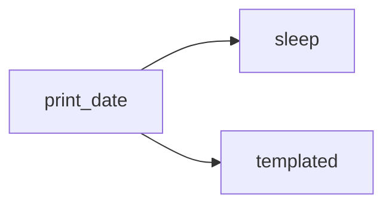



{}
<i class="icon-magic"></i> **AI 요약 & 가이드**

Apache Airflow PR [#66809](https://github.com/apache/airflow/pull/66809)이 머지된 후,
이전 글에서 다룬 초기 구현 과정을 최종 코드 기준으로 다시 정리한 글입니다.
`doc_md`의 인라인 코드 렌더링 문제에서 출발해 코드 블록, KaTeX 수식, Mermaid 다이어그램 렌더링 개선 및
문서 보강과 코드 리뷰 반영까지 이어진 실제 오픈소스 기여 과정을 따라갈 수 있습니다.

- **[배경과 목적](#배경과-목적)**: Airflow UI에서 `doc_md`의 인라인 코드가 코드 블록처럼 보이던 문제를 왜 직접 고치게 되었는지 설명합니다.
- **[기존 코드 분석](#코드-분석---마크다운-렌더링-321)**: `code` 컴포넌트와 `pre` 컴포넌트의 역할이 왜 문제를 만들었는지 분석합니다.
- **[최종 변경 사항](#변경-사항---마크다운-렌더링-340)**: 최종 머지된 코드 기준으로 인라인 코드와 코드 블록이 어떻게 분리되었는지 정리합니다.
- **[수식 렌더링](#수식katex-렌더링)**: KaTeX CSS를 필요한 시점에만 동적으로 불러오고, 렌더링 실패 시 예외 처리하는 구조를 설명합니다.
- **[Mermaid 렌더링](#mermaid-렌더링)**: 테마가 변경될 때만 Mermaid 다이어그램을 초기화하도록 개선한 최종 구현을 살펴봅니다.
- **[PR 개선 과정](#pr-개선-과정)**: 정적 체크, 인라인 수식 제거, 문서 보강 등 리뷰를 거치며 PR이 어떻게 다듬어졌는지 따라갑니다.
{}

2026년 5월 13일부터 Apache Airflow에서 작업한 PR [#66809](https://github.com/apache/airflow/pull/66809)이
약 2달의 기간을 지나서 지난 6월 30일에 머지되었습니다.



처음엔 오픈소스 컨트리뷰션 아카데미(OSSCA) 체험형 과정의 일환으로
단순한 UI 기능 개선을 시도한 것이 PR을 올리게 된 계기였지만,
그것이 생각보다 많은 곳에 영향을 주는 광범위한 기능이어서 커미터로부터 대략 48개의 리뷰를 받고
OSSCA 과정이 끝난 후에도 지속적으로 코드 수정과 CI 테스트 통과를 반복했습니다.

[이전 글](/blog/pr-66809-doc-md.md)에서 Apache Airflow의 기존 마크다운 렌더링 방식을 이해하며
초기 계획에 따라 개선하는 과정을 보여드렸고 글 작성 이후 추가된 변경 사항들을 해당 글 아래에 추가할 예정이었지만,
수식 사용 방식 등 초기 계획과 비교해 크게 달라진 점들이 생겨서 아예 새로운 글에서
최종 머지된 변경사항을 기준으로 Airflow의 마크다운 렌더링을 개선한 과정을 설명드리겠습니다.

## 배경과 목적

Apache Airflow는 Dag 또는 Task에 대한 설명을 `doc_md`라는 속성으로 추가할 수 있도록 지원합니다.
`doc_md` 속성으로 추가된 문자열은 Airflow UI에서 마크다운 렌더링되어 사용자에게 표시됩니다.

하지만, 제가 당시에 사용했던 3.2.x 버전의 Airflow UI의 마크다운 렌더링은 제목이나 이미지 등
기본적인 렌더링만 지원하고 코드 블록에 대한 렌더링이 만족스럽지 않았습니다.

아래 이미지는
[Airflow 3.1.3 버전의 튜토리얼 문서](https://airflow.apache.org/docs/apache-airflow/3.1.3/tutorial/fundamentals.html#adding-dag-and-tasks-documentation)에서
`doc_md`를 설명하면서 사용하는 이미지인데, 다음과 같이 1개의 백틱(\`)으로 감싼 인라인 코드 블록(Inline Code Block)이
3개의 백틱(\`\`\`)으로 감싸진 펜스 코드 블록(Fenced Code Block)의 형태로 보여지는 것을 알 수 있습니다.
(편의상 앞으로 "인라인 코드 블록"은 "인라인 코드", "펜스 코드 블록"은 "코드 블록"이라고 부르겠습니다.)

> ... the attributes \`doc_md\` (markdown), \`doc\` (plain text), \`doc_rst\`, \`doc_json\`, \`doc_yaml\` which gets ...


저는 마크다운으로 기술 문서를 작성할 때 인라인 코드 활용 빈도가 많은 편인데
현재 버전의 Airflow에서는 인라인 코드를 활용할 수 없어
할 수 없이 문서에서 백틱(\`)을 홑따옴표(')로 대체해서 표현하고 있었습니다.

공식 문서에서 이런 이미지를 남긴 것을 보면 모르고 방치한 것 같진 않아 보이는데,
그렇다면 메인테이너 쪽에서 이 문제를 개선할 생각이 없어 보여서
제가 직접 마크다운 렌더링 기능을 개선하기로 했습니다.

### 구현 계획

구현하고자 하는 기능은 명확합니다.

처음 시작할 때의 의도는 인라인 코드가 의도대로 렌더링되지 않던 문제를
해결하고 코드 블록에 복사 버튼 등 편리한 기능을 추가하는 것을 계획했습니다.
그래도 큰맘먹고 PR을 올려보는데 필요한 기능은 다 넣어보는게 낫겠다 싶어서
마크다운 렌더링하면 꼭 있어야 한다고 생각하는 수식과 Mermaid 다이어그램 렌더링도
지원하기로 계획했습니다.

{}
1. 인라인 코드 렌더링 오류 해결
2. 코드 블록에 언어 라벨 및 복사 버튼 추가
3. 수식 렌더링 지원
4. Mermaid 다이어그램 렌더링 지원
{}

## 코드 분석 - 마크다운 렌더링 (3.2.1)

우선, 인라인 코드를 코드 블록 형태로 보여지는 문제가 발생하는 원인을 파악하기 위해
Github에 공개된 [Airflow 코드베이스](https://github.com/apache/airflow)를
분석해야 합니다.
(해당 글에서 안내하는 "기존 코드"는 PR을 생성할 당시 가장 최신이었던 3.2.1 버전을 가리킵니다.)

저는 프론트엔드 개발자도 아니고 Airflow UI 구조에 대한 배경지식도 없었기 때문에
로컬에 내려받은 Airflow 코드베이스를 Codex에게 던져주면서 `doc_md`의 마크다운 렌더링에
영향을 주는 지점을 파악해달라고 요청했습니다.

### 마크다운 컴포넌트 렌더링

그렇게 발견한 마크다운 렌더링을 실행하는 지점이
`airflow-core/src/airflow/ui/src/components/ReactMarkdown.tsx` 파일이었습니다.
파일 내용에서 각각의 마크다운 컴포넌트를 어떻게 생성할지 분기하는 부분이 아래의 `ReactMarkdown` 함수입니다.

일반적으로 HTML에서 인라인 코드는 `<code>` 태그로 감싸진 요소로 나타내고,
코드 블록은 `<code>` 요소를 `<pre>` 태그로 감싼 형태로 표현합니다.
Airflow의 `ReactMarkdown.tsx`에서는 코드 블록을 그보다 단순하게,
리액트의 `Box` 컴포넌트로 코드 내용을 감싸서 보여줍니다.

```typescript
const PreComponent = ({ children }: PropsWithChildren) => <Box my={3}>{children}</Box>;

const ReactMarkdown = (props: Options) => {
  const { colorMode } = useColorMode();
  const style = colorMode === "dark" ? oneDark : oneLight;

  const components = {
    a: LinkComponent,
    blockquote: BlockquoteComponent,
    // 인라인 코드 + 코드 블록 렌더링
    code: createCodeComponent(style),
    ...
    // 코드 블록 컨테이너 생성
    pre: PreComponent,
    ...
  };

  return <ReactMD components={components as Components} {...props} remarkPlugins={[remarkGfm]} skipHtml />;
};
```

### 코드 블록 렌더링

문제는 `<code>` 요소를 표현하는데 사용하는 `createCodeComponent` 함수에
`inline` 파라미터를 명시만 했지 실제로 단일 백틱(\`) 구문에 `inline = true` 옵션을 제공하지는 않아서
`if (inline) { ... }` 구문이 처리될 일 없이 매번 코드 블록 형태로 렌더링된 것이었습니다.

```typescript
const createCodeComponent =
  (style: typeof oneDark | typeof oneLight) =>
  ({
    children,
    className,
    inline,
  }: {
    readonly children: ReactNode;
    readonly className?: string;
    readonly inline?: boolean;
  }) => {
    if (inline) {
      // 인라인 코드 렌더링
      return (
        <Code display="inline" p={2}>
          {children}
        </Code>
      );
    }
    ...
    // 코드 블록 렌더링 (코드 하이라이팅)
    return (
      <SyntaxHighlighter language={language ?? "text"} PreTag="div" style={style} wrapLongLines>
        {childString.replace(/\n$/u, "")}
      </SyntaxHighlighter>
    );
```

제가 리액트를 잘 아는건 아니지만 해당 파일만 보고 추측하기로는,
`<pre>` 요소는 `<code>` 요소를 감싸는 껍데기로만 사용되고 실질적으로
인라인 코드와 코드 블록 모두 `createCodeComponent` 함수라는 단일 지점에서
렌더링을 처리한다는 것으로 이해했습니다.

하지만, 인라인 코드를 처리할 때 분기를 발생시키는 `inline` 파라미터가 사용되지 않기 때문에
실질적으로 인라인 코드도 코드 블록처럼 처리되고 있다는 결론에 이르렀습니다.

저는 인라인 코드와 코드 블록을 서로 다른 지점에서 처리해야 한다고 생각하기에
기존 코드가 잘못되었다는 판단하에 이번 PR을 시작했습니다.

## 변경 사항 - 마크다운 렌더링 (3.4.0)

PR [#66809](https://github.com/apache/airflow/pull/66809)에서 최종적으로
변경된 파일은 다음과 같습니다. (트리 구조에서 새로 추가된 파일명 뒤에는 `(+)` 기호를 추가했습니다.)

```bash
airflow-core/
├── docs/
│   ├── core-concepts/
│   │   └── dags.rst
│   ├── img/
│   │   ├── ui-dark/
│   │   │   ├─- dag_doc_md.png (+)
│   │   │   └─- task_doc_md.png (+)
│   │   └── ui-light/
│   │       ├─- dag_doc_md.png (+)
│   │       └─- task_doc_md.png (+)
│   └── tutorial/
│       └── fundamentals.rst
└── src/airflow/
    ├── example_dags/
    │   └── tutorial.py
    └── ui/
        ├── src/
        │   ├── components/
        │   │   ├─- KatexStyleLoader.ts (+)
        │   │   ├─- ReactMarkdown.test.tsx (+)
        │   │   ├── ReactMarkdown.tsx
        │   │   └─- ReactMarkdownBlocks.tsx (+)
        │   └── utils/
        │       ├─- renderMermaid.ts (+)
        │       └── syntaxHighlighter.ts
        ├── package.json
        └── pnpm-lock.yaml
```

마크다운 렌더링 기능과 관련된 파일들은 전부 `airflow-core/src/airflow/ui/src/`
경로 아래에 있고, 나머지는 문서 수정 및 문서 내에 이미지를 추가한 것입니다.

마크다운 렌더링이 구현된 `ReactMarkdown.tsx` 파일에서 코드 블록 렌더링 기능만 따로 분리하여
`ReactMarkdownBlocks.tsx` 파일로 만들었고, 구현 계획에 따라 수식과 Mermaid 렌더링도 지원하기 위해
관련 기능을 `KatexStyleLoader.ts`, `renderMermaid.ts` 파일로 구현했습니다.

문서쪽에서는, 기존 튜토리얼 문서를 바탕으로 변경 사항을 충분히 나타낼 수 있도록 `doc_md`를 다시 작성했습니다.
변경 사항이 반영된 문서는 다음 이미지처럼 렌더링됩니다.
수식과 Mermaid도 코드 블록과 같은 취급으로 다뤄지는데, 코드 블록을 표현하는 3중 백틱(\`\`\`) 뒤에
언어를 `math`라고 명시하면 수식으로, `mermaid`라고 명시하면 Mermaid 다이어그램으로 렌더링되는 방식입니다.
(아래 탭을 전환하여 캡처 이미지와 doc_md 문자열을 비교해보시면 직관적으로 이해하실 수 있습니다.)

<div id="task-doc-md" class="display: none;"></div>

{}

{}

{}

{}
~~~markdown
#### Print the current date

This task runs `date` by using the `bash_command` argument on `BashOperator`.
In the Task Instance Details page, Airflow renders this documentation from
the task's `doc_md` field. After this task succeeds, Airflow can run both
downstream tasks: `sleep` and `templated`.

```bash
date
```

Math fences are rendered with KaTeX. This tutorial starts one task and then
branches into two downstream tasks:

```math
1\\ \\text{upstream task} + 2\\ \\text{downstream tasks} = 3\\ \\text{tasks}
```

The same dependency is shown as a Mermaid diagram:


~~~
{}

{}

초기에는 Airflow 3.3.0 마일스톤에 포함되었지만
PR이 머지되지 않은 채 약 2달 간 유지되다 보니 3.4.0 마일스톤으로 옮겨졌습니다.

### 마크다운 컴포넌트 렌더링

변경된 `ReactMarkdown` 함수는 다음과 같습니다.

PR을 개선하는 중에도 Airflow가 3.2.2 버전으로 업데이트되는 등 제가 의도하지 않은 변경사항들이 있지만,
핵심은 `code` 컴포넌트는 항상 인라인 코드만 처리하고, `pre` 컴포넌트에 해당하는
코드 블록의 처리는 `createPreComponent` 함수에 위임하도록 변경한 점입니다.

```typescript
const InlineCodeComponent = ({ children }: PropsWithChildren) => <Code display="inline">{children}</Code>;

const createMarkdownComponents = (style: SyntaxTheme): Components => ({
  a: LinkComponent,
  blockquote: BlockquoteComponent,
  // 인라인 코드 렌더링
  code: InlineCodeComponent,
  ...
  // 코드 블록 렌더링
  pre: createPreComponent(style),
  ...
});

const ReactMarkdown = ({ children, components: componentOverrides, ...restProps }: Options) => {
  const { colorMode } = useColorMode();
  const style = colorMode === "dark" ? oneDark : oneLight;
  const components = createMarkdownComponents(style);

  return (
    <Box alignSelf="stretch" css={markdownContentStyles} maxWidth="100%" minWidth={0} width="100%">
      <ReactMD components={{ ...components, ...componentOverrides }} {...restProps} remarkPlugins={[remarkGfm]} skipHtml >
        {children}
      </ReactMD>
    </Box>
  );
};
```

### 코드 블록 파싱

이어서 코드 블록 렌더링을 처리하는 `createPreComponent` 함수의 내용은 다음과 같습니다.

3중 백틱(\`\`\`)으로 감싸진 내용에서 언어 문자열 `language`와 실제 코드 내용 `codeText`를
파싱하고 렌더링은 다시 별도의 모듈 `ReactMarkdownBlocks`에 구현한 `MarkdownCodeBlock` 컴포넌트에
위임했습니다.

```typescript
import { MarkdownCodeBlock } from "./ReactMarkdownBlocks";

const createPreComponent =
  (style: SyntaxTheme) =>
  ({ children }: { readonly children?: ReactNode }) => {
    const [codeElement] = Children.toArray(children);

    if (!isValidElement<MarkdownCodeElementProps>(codeElement)) {
      return <Box my={3}>{children}</Box>;
    }

    const { children: codeChildren, className } = codeElement.props;
    const match = /language-(?<lang>[-\w]+)/u.exec(className ?? "");
    // 언어 문자열 파싱
    const language = match?.groups?.lang;

    // 코드 내용 파싱
    const codeText = Array.isArray(codeChildren)
      ? codeChildren.map((child) => (typeof child === "string" ? child : "")).join("")
      : typeof codeChildren === "string"
        ? codeChildren
        : "";

    const childString = codeText.replace(/\n$/u, "");

    // `ReactMarkdownBlocks` 모듈에서 코드 블록 렌더링 처리
    return <MarkdownCodeBlock language={language} style={style} value={childString} />;
  };
```

### 코드 블록 분기 처리

앞에서 파싱된 코드 블록의 내용을 전달받아 코드 블록 렌더링을 처리하는 `MarkdownCodeBlock` 컴포넌트는
언어 문자열 `language`를 조건문에 넣어서 주어진 코드 블록을 수식, Mermaid, 또는 일반 코드 블록으로 다뤄야 하는지를 판단하고,
각각 `MarkdownMathBlock`, `MarkdownMermaid`, `MarkdownPlainCodeBlock` 컴포넌트 중 하나에 위임합니다.

```typescript
export const MarkdownCodeBlock = ({
  language,
  style,
  value,
}: {
  readonly language?: string;
  readonly style: SyntaxTheme;
  readonly value: string;
}) => {
  if (language === "math") {
    // 수식 렌더링 (```math)
    return <MarkdownMathBlock style={style} value={value} />;
  }

  if (language === "mermaid") {
    // Mermaid 렌더링 (```mermaid)
    return <MarkdownMermaid chart={value} fallbackStyle={style} />;
  }

  // 일반 코드 블록 렌더링 (```typescript 등)
  return <MarkdownPlainCodeBlock language={language} style={style} value={value} />;
};
```

### 일반 코드 블록 렌더링

먼저, 일반 코드 블록 렌더링을 처리하는 `MarkdownPlainCodeBlock` 컴포넌트의 내부는 다음과 같습니다.

일반 코드 블록은 코드 하이라이팅을 처리하는 `SyntaxHighlighter` 컴포넌트를 `Box` 컴포넌트로 두 번 감싼 형태입니다.
[기존 코드로 렌더링된 코드 블록](#코드-블록-렌더링)은 단일 `Box` 컴포넌트로 감싸진 형태였는데,
텍스트의 길이에 맞춰서 너비가 정해졌습니다.

저는 코드 블록은 항상 문서 너비를 가득 채워야 한다고 생각해서 기존 `Box` 컴포넌트의 바깥쪽에
`width="100%"` 스타일을 적용한 `Box` 컴포넌트를 추가했습니다.
또한, 해당 바깥쪽 `Box` 컴포넌트는 가로 스크롤을 보여주는 역할도 담당합니다.
기존 코드에서는 코드 내용이 본문 너비를 넘어가면 줄바꿈되는 문제가 있었는데,
그러면 가독성이 매우 떨어지기 때문에 스크롤을 추가했습니다.

```typescript
import { LazyClipboard } from "src/components/ui";

const MarkdownPlainCodeBlock = ({
  language,
  style,
  value,
}: {
  readonly language?: string;
  readonly style: SyntaxTheme;
  readonly value: string;
}) => {
  ...
  // 복사 버튼 + 언어 라벨
  const action = <LazyClipboard getValue={() => value} ... />
  const label = language ?? "text"

  // 코드 블록 렌더링
  return (
    <MarkdownBlockFrame action={action} label={label}>
      <Box data-testid="markdown-code-scroll-area" overflowX="auto" width="100%" ... >
        <Box data-testid="markdown-code-content" ... >
          <SyntaxHighlighter ... >
            {value}
          </SyntaxHighlighter>
        </Box>
      </Box>
    </MarkdownBlockFrame>
  );
};
```

그 외에 [변경 사항이 반영된 문서](#task-doc-md)에서 보이는 것처럼
코드 블록의 상단에 언어 라벨과 복사 버튼을 추가했습니다.
언어 라벨은 단순히 `Text` 컴포너트를 사용했고,
복사 버튼은 Airflow 내부에 이미 구현된 `LazyClipboard` 컴포넌트를 가져다 사용했습니다.

(블로그의 코드 하이라이팅 문제로 편의상 `action`과 `label` 속성 값을 별도의 상수로 분리했습니다.
실제로는 상수 선언 없이 중괄호 안에 `LazyClipboard` 등의 요소가 직접 들어갑니다.)

3가지 코드 블록에서 공통적으로 사용되는 `MarkdownBlockFrame` 컴포넌트의 내용은 생략하지만,
간단히 설명드리자면 언어 라벨 `label`과 복사 버튼 `action`을 `Flex` 컴포넌트로 감싸서
각각 왼쪽 정렬 및 오른쪽 정렬되게 처리하는 동작을 합니다.

### 수식(KaTeX) 렌더링

수식 렌더링을 처리하는 `MarkdownMathBlock` 컴포넌트의 내부는 다음과 같습니다.

수식 렌더링은 서드파티 라이브러리 `katex`에 의존하며,
`katexStyleLoader` 함수를 통해 KaTex CSS(`katex/dist/katex.min.css`)의 동적 임포트를 수행합니다.
그래서, 문서 내에 수식이 없다면 KaTex CSS가 호출되지 않아
수식을 사용하지 않는 사용자들에게 발생할 영향을 최소화했습니다.

{}

{}
```typescript
import { renderToString as renderKatexToString } from "katex";
import { useEffect, useId, useState, type ReactNode } from "react";

import { katexStyleLoader } from "./KatexStyleLoader";

const MarkdownMathBlock = ({ style, value }: { readonly style: SyntaxTheme; readonly value: string }) => {
  ...
  // KaTex CSS 동적 임포트
  useEffect(() => { void katexStyleLoader.load(); }, []);

  try {
    // katex 라이브러리를 사용한 수식 렌더링
    const markup = renderKatexToString(value, { displayMode: true, throwOnError: true });

    // 코드 블록 렌더링 (수식 포함)
    return (
      <MarkdownBlockFrame action={<LazyClipboard ... />} label="math">
        <Box ... >
          <Box dangerouslySetInnerHTML={{ __html: markup }} ... />
        </Box>
      </MarkdownBlockFrame>
    );
  } catch {
    // 수식 렌더링 실패 시 예외 처리
    return <MarkdownPlainCodeBlock language="math" style={style} value={value} />;
  }
};
```
{}

{}
```typescript
const createKatexStyleLoader = () => {
  let katexStylesPromise: Promise<void> | undefined;

  return () => {
    // KaTex CSS 동적 임포트
    katexStylesPromise ??= import("katex/dist/katex.min.css").then(() => undefined);

    return katexStylesPromise;
  };
};

export const katexStyleLoader = {
  load: createKatexStyleLoader(),
};
```
{}

{}

마찬가지로 일반 코드 블럭처럼 언어 라벨로 `math`를 표시하고,
렌더링되기 전의 KaTex 표현식을 복사할 수 있는 버튼도 추가했습니다.

그리고, 수식 렌더링이 실패했을 경우 일반 코드 블록의 형태로
KaTex 표현식을 보여주도록 예외 처리했습니다.

### Mermaid 렌더링

Mermaid 렌더링을 처리하는 `MarkdownMermaid` 컴포넌트의 내부는 다음과 같습니다.

Mermaid 렌더링은 서드파티 라이브러리 `mermaid`에 의존하며,
`renderMermaidDiagram` 함수를 통해 Mermaid 다이어그램 표현식을 svg 형식으로 렌더링합니다.
최초 렌더링 또는 테마가 변경된 경우만 Mermaid 다이어그램을 초기화하는 방식으로 성능을 개선했습니다.

{}

{}
```typescript
import { renderMermaidDiagram } from "src/utils/renderMermaid";

export const MarkdownMermaid = ({
  chart,
  fallbackStyle,
}: {
  readonly chart: string;
  readonly fallbackStyle: SyntaxTheme;
}) => {
  ...
  const theme = colorMode === "dark" ? "dark" : "default";

  useEffect(() => {
    const renderMermaid = async () => {
      // Mermaid 렌더링 (try-catch 예외 처리 생략)
      const renderedSvg = await renderMermaidDiagram({chart, diagramId, theme});
      setSvg(renderedSvg);
    };
    ...
  }, [chart, diagramId, theme]);

  if (error) {
    // Mermaid 렌더링 실패 시 예외 처리
    return <MarkdownPlainCodeBlock language="mermaid" style={fallbackStyle} value={chart} />;
  }

  // 코드 블록 렌더링 (Mermaid 다이어그램 포함)
  return (
    <MarkdownBlockFrame action={<LazyClipboard ... />} label="mermaid">
      <Box ... >
        {svg === undefined ? <Box ... > : <Box dangerouslySetInnerHTML={{ __html: svg }} ... />}
      </Box>
    </MarkdownBlockFrame>
  );
};
```
{}

{}
```typescript
import type { Mermaid } from "mermaid";

type MermaidTheme = "dark" | "default";

let initializedTheme: MermaidTheme | undefined;
let mermaidModulePromise: Promise<Mermaid> | undefined;

export const renderMermaidDiagram = async ({
  chart,
  diagramId,
  theme,
}: {
  readonly chart: string;
  readonly diagramId: string;
  readonly theme: MermaidTheme;
}): Promise<string> => {
  mermaidModulePromise ??= import("mermaid").then((module) => module.default);

  const mermaid = await mermaidModulePromise;

  if (initializedTheme !== theme) {
    // 최초 렌더링 또는 테마가 변경된 경우만 Mermaid 다이어그램 초기화
    mermaid.initialize({ securityLevel: "strict", startOnLoad: false, theme });
    initializedTheme = theme;
  }

  // Mermaid 다이어그램 표현식을 렌더링하여 svg 생성
  const { svg } = await mermaid.render(diagramId, chart);

  return svg;
};
```
{}

{}

수식 렌더링과 마찬가지로 언어 라벨로 `mermaid` 표시 및 복사 버튼을 추가했으며,
Mermaid 렌더링이 실패했을 경우 일반 코드 블록의 형태로 Mermaid 다이어그램 표현식을 보여주도록
예외 처리했습니다.

### 문서 내용 추가

튜토리얼 문서는 마크다운 렌더링을 개선하기 전에 맞춰졌기 때문에
사용자들에게 어떤 기능을 사용할 수 있는지 알리기 위해 문서에 내용을 추가했습니다.

첫 번째로 수정한 부분은 "Dags" 문서의
[Dag & Task Documentation](https://airflow.apache.org/docs/apache-airflow/3.2.1/core-concepts/dags.html#dag-task-documentation)
문단입니다. 문단의 중간에 다음과 같은 내용을 추가했습니다.

```rst
... Markdown files are recognized by str ending in ``.md``.
<<<<<<< 새로 추가된 내용
Dag documentation is rendered as Markdown, so fenced code blocks, tables,
and other common Markdown constructs are supported.
Fenced code blocks whose language is ``math`` are rendered with KaTeX,
and Mermaid diagrams are rendered from fenced code blocks whose language is ``mermaid``.
```

두 번째로 수정한 부분은 "Airflow 101: Building Your First Workflow" 문서의
[Adding Dag and Tasks documentation](https://airflow.apache.org/docs/apache-airflow/3.2.1/tutorial/fundamentals.html#adding-dag-and-tasks-documentation)
문단입니다.
마찬가지로 수식과 Mermaid를 지원한다는 문구를 추가했습니다.

```rst
Adding Dag and Tasks documentation
----------------------------------
<<<<<<< 변경 전
You can add documentation to your Dag or individual tasks. While Dag documentation currently supports markdown, task
documentation can be in plain text, markdown reStructuredText, JSON, or YAML. It's a good practice to include
documentation at the start of your Dag file.

<<<<<<< 변경 후
You can add documentation to your Dag or individual tasks. Dag documentation is rendered as Markdown in the UI.
Task documentation can be in plain text, markdown, reStructuredText, JSON, or YAML. When you use ``doc_md`` for
task documentation, Airflow renders common Markdown features such as inline code, fenced code blocks, fenced code blocks
in ``math`` that render with KaTeX, and Mermaid diagrams in ``mermaid`` fences.

In the tutorial Dag, the ``print_date`` task uses ``doc_md`` to explain the bash command it runs, describe the
downstream ``sleep`` and ``templated`` tasks, and show the Markdown features available in the Task Instance Details
page. It's a good practice to keep this documentation close to the task it describes.
```

그리고, 튜토리얼 문서에서는 `example_dags/tutorial.py` Dag의 `[START documentation]` 키워드부터
`[END documentation]` 키워드까지의 부분을 참조하는데,
그 안에 포함된 이미지도 새로 캡처하여 업데이트했습니다.



<--->



## PR 개선 과정

이제까지는 최종 머지된 변경 사항을 기준으로 설명드렸지만,
초기 변경 사항은 지금과는 다소 다른 형태였습니다.

동적 임포트 등 눈에 보이지는 않지만 성능적으로 개선한 점이 있는가 하면,
수식 표현을 2중 달러(`$$`) 기호를 사용한 블록 방정식(Block Equation) 렌더링 대신에
코드 블록(`` ```math ``) 형태로 렌더링하게 변경하는 등 기능 또는 시각적인 개선도 있었습니다.

이번에는 다른 분들이 남겨주신 리뷰를 바탕으로 PR을 개선한 과정을 안내드리겠습니다.

### 정적 체크 - prek

리뷰를 받기에 앞서, 처음 PR을 올린 뒤 Github에서 여러 가지 테스트가 진행되었는데, 다음 2가지 테스트에서 실패가 발생했습니다.

{}
1. CI image checks / Static checks
2. provider distributions tests / Compat 3.0.6:P3.10:
{}



Airflow는 코드 품질 기준을 만족하기 위해 정적 체크(Static checks)를 해야 합니다.
[Static code checks](https://github.com/apache/airflow/blob/main/contributing-docs/08_static_code_checks.rst)
문서를 참고하면 자세한 설명을 볼 수 있는데, `uv`를 통해 `prek`을 설치하면 간단하게 정적 체크를 할 수 있습니다.

```bash
uv tool install prek
```

`prek`은 Rust로 작성된 도구로, 기존 `pre-commit`을 대체하는 품질 검사기 입니다.
Rust로 작성되어 매우 빠르다고 안내되는데, 처음에 모르고 전체 파일 검사를 돌려서 10분 정도가 나와 의아했지만
나중에 변경된 파일만 특정해 `prek`을 실행하니 확실히 몇 초도 안되는 속도로 검사가 완료되었습니다.

`prek`은 설치 후 실행하기 전에 활성화해야 합니다. 그 전에 `xmllint`와 `golang`이 먼저 설치되어야 합니다.

```bash
# macOS 기준
brew install libxml2 golang
prek install
```

다음에 `prek`을 실행하려면 다음 명령어를 사용할 수 있습니다.

```bash
# 모든 파일 검사
prek --all-files

# 특정 파일 검사 (여러 개 인자 전달 가능)
prek run --files airflow-core/src/airflow/ui/src/components/ReactMarkdown.tsx
```

제가 `prek`을 실행했을 때, 일부 파일에서 마지막 줄 비워두기 또는 함수 매개변수 줄바꿈 등
코드 가독성 및 품질과 관련된 문제가 정리되었습니다.
이 변경 사항을 새로운 커밋으로 올리니까 정적 검사에 통과했습니다.
Airflow와 같은 대형 프로젝트에서는 이런 코드 품질 검사가 자동화되어 있다는 점이 꽤 인상적이었습니다.

두 번째 실패 Provider tests의 경우 원인을 파악할 순 없었지만,
`Update branch` 버튼을 눌러서 브랜치를 최신 `main` 브랜치와 머지하여 최신화하니까
테스트가 통과되었습니다.

### 인라인 수식 제거

초기 변경 사항에서는 블록 방정식은 2중 달러(`$$`) 기호로, 인라인 수식은 단일 달러(`$`) 기호로
KaTeX 표현식을 감싸서 표현했는데, [@parkhojeong](https://github.com/parkhojeong)님께서
`$` 기호 자체는 수식을 표현하는 용도 외에 화폐 단위를 표현하는 용도로도 사용되기 때문에
의도치 않은 수식 렌더링이 적용될 수 있다는 우려 의견을 주셨습니다.

직접 렌더링한 이미지도 첨부해주셨는데, 이미지를 보니까 확실히 조치가 필요한 문제라고 인식했습니다.



해결책으로 기호를 `$` 대신 `{{ math }}`와 같은 임의의 표현으로 대체한다거나,
사용자들에게 앞으로 화폐 단위를 표현할 때는 escape(`\$`) 하라고 안내하는 등의
방안을 생각해봤지만, 결론적으로 인라인 수식 파싱을 비활성화하는게 가장 간단했습니다.

초기에는 `remark-math` 라이브러리를 사용하여 KaTex 표현식을 파싱했는데,
[공식 문서](https://unifiedjs.com/explore/package/remark-math/#fields)에서
`singleDollarTextMath: false` 옵션을 넣으면 인라인 수식 파싱이 비활성화된다는 것을
확인하고 PR에 반영했습니다.

### KaTeX CSS 동적 임포트

[@parkhojeong](https://github.com/parkhojeong)님께서 앞선 인라인 수식과 관련된
리뷰와 함께 KaTex CSS를 동적 임포트해야 한다는 필요성을 제시해주셨습니다.

초기에는 KaTex CSS(`katex/dist/katex.min.css`)를 리액트의 최초 진입점인 `main.tsx`에서
전역 임포트했는데, 수식을 사용하지 않는 모든 사용자에게도 강제로 수식 리소스를 불러오게 하는
불필요한 비용을 발생시킬 수 있다는 설명을 이해하고 `katexStyleLoader`라는
동적 임포트 함수를 생성 및 사용하도록 변경했습니다.

```typescript
const createKatexStyleLoader = () => {
  let katexStylesPromise: Promise<void> | undefined;

  return () => {
    // KaTex CSS 동적 임포트
    katexStylesPromise ??= import("katex/dist/katex.min.css").then(() => undefined);

    return katexStylesPromise;
  };
};

export const katexStyleLoader = {
  load: createKatexStyleLoader(),
};
```

### Mermaid 모듈 경로 이동

다음으로, Airflow의 프론트엔드 엔지니어인 [@bbovenzi](https://github.com/bbovenzi)님께서
Mermaid 다이어그램을 렌더링하는 기능을 기존 `utils/` 경로 대신에 `context/mermaid/` 경로로 이동하면서
context provider로 변경하라고 제안해주셨습니다.

context provider가 무엇인지 완벽히 이해하지는 못했지만,
리액트의 관점에서 Props를 일일이 넘겨주지 않아도 트리 안의 모든 하위 컴포넌트가
특정 데이터에 쉽게 접근할 수 있게 하는 전역 요소의 역할을 하는 것이라는 설명을 들으니
어렴풋이 이해가 되었습니다. Mermaid는 한 번만 초기화하면 되니까 이 제안이 타당해보였습니다.

그래서 최종적으로 `utils/renderMermaid.ts` 모듈을 `context/mermaid/` 경로 아래에
다음 4가지 파일로 나눠서 구성했습니다.

```bash
airflow-core/src/airflow/ui/src/
└── context/mermaid/
    ├── Context.ts
    ├── index.ts
    ├── MermaidProvider.tsx
    └── useMermaid.ts
```

또한, `main.tsx`의 트리 구조 사이에 `<MermaidProvider>`를 끼워넣었습니다.

```typescript
createRoot(document.querySelector("#root") as HTMLDivElement).render(
  <StrictMode>
    <I18nextProvider i18n={i18n}>
      <QueryClientProvider client={client}>
        <ChakraCustomProvider>
          <ColorModeProvider>
            <MermaidProvider> << 추가
              <TimezoneProvider>
                <RouterProvider router={router} />
              </TimezoneProvider>
            </MermaidProvider> << 추가
          </ColorModeProvider>
        </ChakraCustomProvider>
      </QueryClientProvider>
    </I18nextProvider>
  </StrictMode>,
);
```

하지만, 한 달쯤 후에 [@pierrejeambrun](https://github.com/pierrejeambrun)님께서
`context/mermaid/` 경로 아래의 모듈과 `main.tsx`의 변경 사항이 필요 이상으로
복잡해 보인다는 의견을 주면서 작은 유틸리티 함수로 통합할 것을 제안주셨습니다.

[@bbovenzi](https://github.com/bbovenzi)님의 제안과 상반되는,
초기 계획과 같은 형태의 구현 방식이었는데, [@bbovenzi](https://github.com/bbovenzi)님도
이에 동의하셔서 다시 원래의 유틸리티 함수 형태로 되돌렸습니다.

이때, 수식 렌더링에서의 전역 임포트와 마찬가지로 Mermaid 다이어그램도 매번 초기화하는 불필요한 비용이
발생했는데, [@pierrejeambrun](https://github.com/pierrejeambrun)님께서
이 부분을 지적해주셔서 `renderMermaid.ts` 모듈을 되돌리면서 같이 반영했습니다.

결론적으로, Mermaid 렌더링 모듈은 경로 이동 없이 유틸리티 함수의 위치를 유지했고,
대신에 테마가 변경될 때만 다이어그램을 초기화하도록 효율을 개선한 차이가 있었습니다.

### 문서 내용 추가

지금까지의 변경 사항에서 문서를 수정해야 한다는 생각을 못하고 기능 추가만 했었는데,
[@jscheffl](https://github.com/jscheffl)님께서 지금 상태로는 머지된 후에
해당 기능에 대해 누구도 알 수 없을 것이란 의견을 주시면서 문서에 힌트를 추가하라고
제안주셨습니다.

동시에 어떤 문서를 수정해야 하는지도 알려주셔서 다음 2가지 문서와 Example Dag 1개를 수정했습니다.

1. `airflow-core/docs/core-concepts/dags.rst` 파일에 해당하는
   [Dags](https://airflow.apache.org/docs/apache-airflow/stable/core-concepts/dags.html#dag-task-documentation) 문서
2. `airflow-core/docs/tutorial/fundamentals.rst` 파일에 해당하는
   [Airflow 101: Building Your First Workflow](https://airflow.apache.org/docs/apache-airflow/stable/tutorial/fundamentals.html#adding-dag-and-tasks-documentation) 문서
3. `airflow-core/src/airflow/example_dags/tutorial.py` 파일에 해당하는 Example Dag

어떤 내용을 변경했는지는 [앞선 문단](#문서-내용-추가)을 참고해주시기 바랍니다.

### 수식 표현 방식 변경

[@pierrejeambrun](https://github.com/pierrejeambrun)님께서 마지막으로
수식 표현 방식을, 모호한 2중 달러(`$$`) 기호 대신에 코드 블록과 일관성 있는 표현(`` ```math ``)으로
변경하는 것을 제안했습니다.

앞에서 달러(`$`) 기호가 화폐 표현으로 사용되는 문제로 [인라인 수식을 제거](#인라인-수식-제거)했던 것처럼
2중 달러(`$$`) 기호도 비슷한 문제를 일으킬 수 있다는 의견에 동의하여
코드 블록과 동일한 렌더링 방식으로 변경했습니다.



수식 위에 코드 블록처럼 언어 라벨과 복사 버튼이 추가되어
수식 영역이 세로로 길어진 부분은 개인적으로 마음에 들지는 않았지만,
코드 자체는 `ReactMarkdownBlocks.tsx` 모듈에서 언어 문자열에 따라
수식, Mermaid, 또는 일반 코드 블록으로 분기하는 [지금의 렌더링 방식](#코드-블록-분기-처리)으로
깔끔하게 변경할 수 있었다는 점에서는 만족했습니다.

그렇게 최종적으로 [@pierrejeambrun](https://github.com/pierrejeambrun)님께서
Airflow 3.4.0 마일스톤에 등록해주시면서 Airflow의 `main` 브랜치에 머지되었습니다.



## 배운 점

이번 PR은 Airflow의 UI의 기능을 개선하는 작업이었지만,
제가 리액트 및 프론트엔드에 대한 지식이 부족하다 보니 시작부터 끝까지 생성형 AI의 도움을 받았습니다.
하지만, 그 과정에서 제가 이해하지 못해 검수되지 않은 잘못된 코드가 리뷰어에게 전달되어
지적을 받았습니다.

PR 개선 과정에는 기록하지 않았지만 PR을 최초로 생성한 직후 발생한 Github Copilot의
제안을 그대로 수용하여 Airflow의 의도와 맞지 않는 변경 사항을 적용한 문제가 있었습니다.
코드 하이라이팅에서 제한된 언어만 하이라이팅 처리하여 리소스를 아끼던 기존 방식에서
모든 언어를 하이라이팅 처리하도록 변경한 문제였는데,
가장 먼저 리뷰를 남겨주신 [@choo121600](https://github.com/choo121600)님께서
지적해주셔서 원래대로 돌려놨습니다.

이번 PR이 Airflow UI에 미치는 영향에 대해서도 과소평가했습니다.
처음에는 `doc_md`에서 발생한 인라인 코드 렌더링 문제를 해결하려는 작은 의도에서 시작되었지만,
마크다운 렌더링을 담당하는 `ReactMarkdown.tsx` 모듈은 `doc_md`를 비롯한
Airflow UI 내 모든 마크다운 렌더링에 영향을 주는 대상이었습니다.
이 때문에 머지 후 발생할 영향을 최소화하기 위해 수식 표현 방식 등에서 여러 번 수정이 발생했습니다.

마지막으로, Airflow의 문서 내용도 건드리게 되어 Airflow가 어떤식으로
문서를 관리하는지 구조를 이해할 수 있었습니다. `reStructuredText` 문서 형식은
작년에 PyTorch 튜토리얼 문서를 번역할 때 경험한 형식이어서 익숙했지만,
`[START documentation]`라는 키워드를 통해 Example Dag에 기록된
파이썬 코드 일부를 문서 내용으로 참조하는 방식은 처음 겪어봐서 새로웠습니다.

가벼운 마음으로 시작한 PR이었지만, Airflow의 UI 구조와 문서 구조에 대해서 이해할 수 있었고,
해외의 실력 있는 개발자 분들로부터 리뷰로 다양한 지적을 받으면서 프론트엔드에서는
어떤 부분을 신경쓰고 어떤 스타일로 코드를 작성해야 하는지 배울 수 있었습니다.
특히, 제 PR에 관심을 갖고 지적해주시는 리뷰어 분들이 부적절하게 짜여진 코드를 읽으면서
시간을 낭비하지 않도록 제가 먼저 확실하게 코드를 검수해야 한다는 것을 주의하고 또 주의해야겠다고 다짐했습니다.

Airflow에 제가 기여했다는 결과보다 여러 개발자 분들이 남기신 리뷰에 대응하면서
스스로가 깨달은 과정이 더욱 값진 경험으로 남았습니다.
