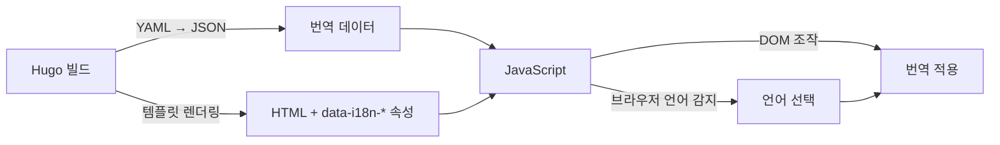

<style>
.screenshot-image { border: 3px solid var(--gray-200); }
</style>



{}
<i class="icon-magic"></i> **AI 요약 & 가이드**

Hugo 서택스(SeoTax) 테마에 독자의 언어 선호도를 실시간 반영하는 동적 다국어 번역 시스템을 구현한 과정을 다룹니다.
Hugo의 정적 빌드 방식이 가진 "작가 중심" 번역의 한계를 분석하고, YAML 번역 파일을 JSON으로 통합한 뒤
JavaScript로 DOM 요소를 실시간 번역하는 "독자 중심" 클라이언트 사이드 i18n 시스템 구축 방법을 설명합니다.

- **[Hugo 다국어 지원의 한계](#hugo-다국어-번역의-한계)**: 정적 빌드의 "작가 중심" 문제, 페이지 증가, URL 이동 불편함 분석
- **[동적 번역 설계 전략](#동적-다국어-번역-어떻게-만들까)**: 클라이언트 사이드 렌더링 선택과 Hugo/JavaScript 역할 분담 설계
- **[번역 데이터 준비](#번역-시스템-구현하기)**: YAML 작성 및 JSON 통합 변환, HTML `data-i18n-*` 속성 부여, 전역 함수 초기화
- **[JavaScript 동적 번역](#javascript-동적-번역)**: 텍스트/속성/날짜 번역 로직, `setLanguage()` 함수 구현, `strftime()` 날짜 포맷 변환
- **[언어 선택기 구현](#언어-선택기-구현하기)**: 툴바 드롭다운 UI, change 이벤트 리스너를 활용한 언어 전환 기능
{}

## 다국어 번역, 왜 필요할까?

블로그는 전세계 모든 사람들에게 개방된 공간입니다.

요즘에는 브라우저 상에서 구글 번역 지원이 잘 되어 있어 다른 언어를 사용하는 독자들이
블로그 글을 읽는데 어려움이 없겠지만,
그것은 독자들이 블로그에 관심을 가지고 직접 번역을 수행했을 때 이루어질 일입니다.
비록 좋은 번역 기능이 있더라도, 블로그에 들어오자마자 문서가 미리 번역이 되어있다면
독자들이 관심을 가지지 않고 이탈하는 사례도 줄어들 것입니다.



Hugo 서택스(SeoTax) 테마는 모든 글 내용의 번역을 지원하지는 못하지만,
최소한 UI 요소(메뉴, 버튼, 라벨 등)에 대한 다국어 번역 기능을 제공하도록 설계되었습니다.
특히, 브라우저에서 독자들이 설정한 언어를 인식하여 블로그 접속 시 자동으로 번역해주는 것이 장점입니다.

## Hugo 다국어 번역의 한계

Hugo는 공식적으로 [다국어 번역](https://gohugo.io/content-management/multilingual/)을 지원합니다.
설정 파일에 언어를 정의하고, 컨텐츠 파일명에 언어 코드를 추가하는 방식입니다.   
(또는, 언어 별로 `contentDir` 항목을 추가하고 해당 경로에 언어 코드 없이 컨텐츠 파일을 추가할 수도 있습니다.)

```yaml
defaultContentLanguage: "ko"
languages:
  en:
    languageName: "English"
    weight: 1
  ko:
    languageName: "한국어"
    weight: 2
```

```bash
content/
├── about.en.md   # 영어 버전
├── about.ko.md   # 한국어 버전
└── posts/
    ├── my-post.en.md
    └── my-post.ko.md
```

### 정적 빌드 방식의 문제점

Hugo의 다국어 지원은 **빌드 시점**에 각 언어별 정적 페이지를 생성하는 방식입니다.
이는 몇 가지 근본적인 한계를 가집니다.

||작가 중심의 번역|페이지 증가 문제|
|---|---|---|
|1|작가가 지원하기로 결정한 언어만 제공|언어 수만큼 페이지가 배수로 증가|
|2|빌드 시점에 번역이 고정됨|2개 언어 지원 시 페이지도 2배 증가|
|3|독자의 언어 선호도 즉시 반영 불가|호스팅 용량 및 빌드 시간 증가|

위 모든 문제점들은 글 내용을 전부 번역하려 한다면 어쩔 수 없이 감수해야 하는 부분이지만,
서택스 테마의 관점에서 글 내용은 아직 알 수 없는 영역입니다.
테마에서 지원하는 헤딩, 라벨과 같은 일부 UI 요소들에 대한 번역만 제공할 경우에
이것들은 반드시 해결해야 할 문제점입니다.

예를 들어, 한국어로 "최신글" 라는 라벨 요소가 있다고 가정합니다.
이 요소를 영어로 번역하면 "Recent posts", 그리고 일본어로 번역하면 "最新の投稿"라고
할 수 있습니다. 하지만, 정적 빌드 방식을 사용하면 이 짧은 텍스트를 바꾸기 위해
하나의 컨텐츠에 대한 정적 페이지를 3개나 만들어야 합니다.
만약 이 요소가 모든 컨텐츠에서 공통적으로 포함되어 있다면 모든 컨텐츠에 대한 정적 페이지가 3배로 증가됩니다.

URL 이동을 통해 번역이 이루어지는 것도 문제입니다.
글을 보다가 번역을 하고 싶으면 `/ko/` 경로에서 `/en/` 등 다른 정적 페이지로 이동해야 하고,
이 경우 글을 읽던 지점이 초기화되고 독자의 흐름이 끊길 수 있습니다.

결론적으로, 다국어 번역은 정적 페이지의 이동 없이 JavaScript를 활용해 동적으로 구현할 필요가 있습니다.

## 동적 다국어 번역, 어떻게 만들까?

Hugo의 한계를 극복하기 위해 **클라이언트 사이드 동적 번역** 방식을 선택했습니다.

### 다국어 번역 설계 방향

제가 생각한 다국어 번역의 핵심 기능은 아래 4가지로 요약할 수 있습니다.

{}
1. **브라우저 언어 자동 감지**: `navigator.language`로 독자의 선호 언어 파악
2. **localStorage 저장**: 독자가 선택한 언어를 브라우저에 저장하여 재방문 시에도 유지
3. **실시간 번역 적용**: JavaScript로 DOM 요소의 텍스트, 속성, 날짜 형식을 동적 변경
4. **확장 가능한 구조**: YAML 파일만 추가하면 새로운 언어 지원 가능
{}

### Hugo/JavaScript 역할 분담

일부 UI 요소에 대한 다국어 번역을 지원하는데, JavaScript에서 어떤 요소를 번역할지
HTML 템플릿에 미리 정의할 필요가 있습니다.
이러한 점을 감안하여 Hugo 사이드에서 담당할 역할과 JavaScript에서 담당할 역할을
그래프로 나타내면 다음과 같습니다.



- **Hugo의 역할**: 다국어 YAML 번역 파일을 하나로 통합된 JSON 파일로 변환, HTML에 번역 키 속성 부여
- **JavaScript의 역할**: 브라우저에서 번역 적용, 언어 전환, 날짜 지역화

이 방식의 장점은 **단일 HTML 페이지**에서 모든 언어를 지원할 수 있다는 것입니다.
정적 페이지 수가 늘어나지 않으며, 독자는 페이지 새로고침 없이 언어를 전환할 수 있습니다.
그리고, HTML 요소에 번역 키를 속성으로 부여한 덕분에 번역해야 할 대상을 특정하기도 쉽고
번역된 값을 탐색하는 비용도 매우 적습니다.

## 번역 시스템 구현하기

### YAML 번역 파일 작성

Hugo의 `i18n/` 경로에 언어별 YAML 파일을 작성합니다.
각 번역 항목은 고유한 `id`와 `translation` 값을 가집니다.

이러한 번역 파일 형식은 Hugo에서 지원하는 `i18n` 함수를 이용하기
위해 미리 정의된 형식입니다.
그리고, 서택스 테마의 전신인 [Book 테마](https://github.com/alex-shpak/hugo-book)에서
이미 27개국 언어에 대한 YAML 파일이 작성되어 있어서 그대로 활용했습니다.

{}
```yaml
# themes/seotax/i18n/ko.yaml

- id: "menu.aside.tooltip"
  translation: "메뉴"

- id: "toc.aside.tooltip"
  translation: "목차"

- id: "post.date.format"
  translation: "2006년 1월 2일"
```
<--->
```yaml
# themes/seotax/i18n/en.yaml

- id: "menu.aside.tooltip"
  translation: "Menu"

- id: "toc.aside.tooltip"
  translation: "Table of Contents"

- id: "post.date.format"
  translation: "January 2, 2006"
```
{}

다만, Book 테마의 `id` 값은 "Search", "Edit this page" 와 같은 단순한 단어의 나열이라서,
서택스 테마에서는 `{이름}.{위치}.{요소}` 와 같이 번역 대상을 특정할 수 있는 `id` 값으로 대체했습니다.

서택스 테마에서 제공되는 다국어 번역 파일은 아래 경로를 참고해주시기 바랍니다.



### JSON 번역 데이터 생성

Hugo 빌드하는 시점에서 `i18n/` 경로에 있는 모든 YAML 파일들을 읽고 합쳐서
하나의 JSON 파일을 생성합니다.

통합된 JSON 파일은 `언어 코드` > `번역 키` 단계로
`translation` 에 해당하는 번역 값에 접근할 수 있습니다.

```json
{{/* themes/seotax/assets/data/i18n.json */}}
{{- $i18nData := dict -}}
{{- $i18nDir := default "themes/seotax/i18n" .Site.Params.i18nDir -}}
{{- range os.ReadDir $i18nDir -}}
  {{- if strings.HasSuffix .Name ".yaml" -}}
    {{- $langCode := strings.TrimSuffix ".yaml" .Name -}}
    {{- $filePath := printf "%s/%s" $i18nDir .Name -}}
    {{- $fileContent := os.ReadFile $filePath -}}
    {{- $translations := unmarshal $fileContent -}}
    {{- $langDict := dict -}}
    {{- range $translations -}}
      {{- $langDict = merge $langDict (dict .id .translation) -}}
    {{- end -}}
    {{- $i18nData = merge $i18nData (dict $langCode $langDict) -}}
  {{- end -}}
{{- end -}}
{{- $i18nData | jsonify -}}
```

[앞선 문단](#yaml-번역-파일-작성)에서 작성된 예시 YAML 파일들은
Hugo 템플릿을 거쳐 다음과 같은 JSON 데이터로 변환됩니다.

```json
{
  "ko": {
    "menu.aside.tooltip": "메뉴",
    "toc.aside.tooltip": "목차",
    "post.date.format": "2006년 1월 2일"
  },
  "en": {
    "menu.aside.tooltip": "Menu",
    "toc.aside.tooltip": "Table of Contents",
    "post.date.format": "January 2, 2006"
  }
}
```

### HTML에 번역 속성 추가

번역이 필요한 DOM 요소에 `data-i18n-*` 속성을 추가합니다.
이 속성은 JavaScript에서 어떤 요소를 번역해야 할지 특정하는 표식인 동시에,
해당 요소가 자신의 어떤 속성을 번역해야 하는지 알려주는 힌트이기도 합니다.

```html
<!-- 텍스트 번역 -->
<button data-i18n-id="search.action.label" data-i18n-text>
  {{ i18n `search.action.label` | default `Search` }}
</button>

<!-- 텍스트 번역 (문자열 변환) -->
<span class="search-placeholder" data-i18n-id="search.input.label" data-i18n-text='{"`/`": "$code"}'>
  {{ $searchText := i18n "search.input.label" | default "Press `/` to search" }}
  {{ (replace $searchText "`/`" "<code>/</code>") | safeHTML }}
</span>

<!-- 속성 번역 (aria-label, title 등) -->
<label for="menu-control"
      aria-label="{{ i18n `menu.toggle.tooltip` | default `Toggle Menu` }}"
      title="{{ i18n `menu.toggle.tooltip` | default `Toggle Menu` }}"
      data-i18n-id="menu.toggle.tooltip"
      data-i18n-attrs="aria-label,title">

<!-- 날짜 지역화 -->
<time datetime="{{ .Date.Format `2006-01-02` }}"
      data-i18n-id="post.date.format"
      data-i18n-datetime>
  {{- .Date.Format (i18n "post.date.format" | default "2006-01-02") -}}
</time>
```

모든 다국어 번역이 필요한 요소는 `data-i18n-id` 속성을 포함합니다.
이 속성에는 번역 키가 들어갑니다.

그리고, 나머지 `data-i18n-*` 속성에는 위 예시와 같이 3가지(텍스트, 속성, 날짜) 유형이 있습니다.
1. `data-i18n-text`: 텍스트 콘텐츠 번역 (빈 값이면 단순 텍스트 교체, 또는 일부 문자열 변환)
2. `data-i18n-attrs`: 번역할 속성명 (여러 개라면 쉼표로 구분)
3. `data-i18n-datetime`: 언어 코드별 날짜 형식 변환

특히, 텍스트 번역의 경우 `data-i18n-text` 속성에 `Map` 형식으로 `{"변경 전": "변경 후"}`
문자열을 넣으면 번역 값에서 `변경 전` 에 해당하는 문자열이 `변경 후` 로 대체됩니다.
이것은 일반적으로 번역 결과 중 특정 부분에 HTML 요소를 집어넣고 싶을 때 활용합니다.

### JSON 번역 데이터 초기화

JavaScript로 동적 번역을 수행하기 위해서는 JSON 번역 데이터를 요청해야 합니다.

다국어 번역과 관련된 전역 객체들은 `window.siteI18n` 오브젝트 내에 추가할 것이며,
여기엔 작가의 기본 언어 `.defaultLang`, JSON 번역 데이터 URL `.dataUrl` 등이 기록됩니다.

```html
<script>
  window.siteI18n = window.siteI18n || {};
  window.siteI18n.defaultLang = '{{ default "en" .Site.Params.defaultContentLanguage }}';
</script>

{{- $dataI18n := resources.Get "data/i18n.json" | resources.ExecuteAsTemplate "data/i18n.json" . | resources.Minify | resources.Fingerprint }}
<script>
  window.siteI18n.dataUrl = "{{ $dataI18n.RelPermalink }}";
</script>
```

그리고, 이 오브젝트 안에 `.initData()` 함수를 추가해
JSON 번역 데이터가 없다면 `.dataUrl` 경로로 데이터를 HTTP 요청하고,
한번 데이터를 요청받았다면 JSON 파싱 후 `.data` 전역 객체로 저장해 다음번에 재사용합니다.

```html
<script>
window.siteI18n.initData = function() {
  if (window.siteI18n.data) {
    return Promise.resolve(window.siteI18n.data);
  }

  return fetch(window.siteI18n.dataUrl)
    .then(response => {
      if (!response.ok) {
        throw new Error(`HTTP error! status: ${response.status}`);
      }
      return response.json();
    })
    .then(data => {
      window.siteI18n.data = data;
      return window.siteI18n.data;
    });
};
</script>
```

`.initData()` 함수는 DOM 요소를 동적으로 생성하는 각종 JavaScript 함수에서
다국어 번역을 위해 참조됩니다. 따라서, 이 전역 함수는 어떠한 JavaScript 리소스보다
먼저 로딩되어야 합니다. 여기서 전역 함수를 정의하는 위치와 관련된 주의사항이 있습니다.

{}
<i class="icon-exclamation-triangle"></i> 주의사항<br>
JavaScript 리소스는 브라우저에서 페이지 렌더링 속도를 개선하기 위해
병렬로 다운로드 됩니다. `.initData()` 전역 함수를 별도의 리소스로 분리한 후 다운로드 하려면
로딩 시점을 확정할 수 없기 때문에, 반드시 `<head>` 태그 내에 이 전역 함수를 정의해야 합니다.
{}

`initData()` 함수 외에 `getLanguage()`, `translate()` 전역 함수도 `<head>` 태그 내에서 정의됩니다.



{}
```html
<script>
// localStorage, 브라우저 언어, Hugo 기본 언어 중 하나를 탐지해 반환하는 전역 함수
window.siteI18n.getLanguage = function(translations = {}) { ... }

// 번역 키를 전달하면 번역 값을 반환하는 전역 함수 (JavaScript 리소스에서 단순 번역을 위해 호출)
window.siteI18n.translate = function(id, defaults = '') { ... }
</script>
```
{}

{}
```js
window.siteI18n.getLanguage = function(translations = {}) {
  const storageKey = 'site-language';
  const stored = localStorage.getItem(storageKey);
  if (stored) {
    return stored;
  }

  const browserLang = (navigator.language || navigator.userLanguage).split('-')[0];
  return (!translations || translations[browserLang]) ? browserLang : window.siteI18n.defaultLang;
}
```
{}

{}
```js
window.siteI18n.translate = function(id, defaults = '') {
  if (window.siteI18n.data) {
    const lang = window.siteI18n.getLanguage();
    const translations = window.siteI18n.data[lang];
    if (translations && (id in translations)) {
      return translations[id];
    }
  }
  return defaults;
}
```
{}



## JavaScript 동적 번역

JSON 번역 데이터를 초기화했다면 실제 번역을 수행하는 건
단순히 Map에 키를 조회하면 되기 때문에 간단합니다.

### 정적 페이지 요소를 동적 번역

다른 JavaScript 리소스의 함수에서는 초기화된 번역 데이터를 참조하여 DOM 요소 동적 생성과
동시에 번역을 수행하면 되지만, 정적 페이지의 요소들은 작가의 기본 언어 설정에 맞춰서 초기화되어 있기 때문에
컨텐츠 로딩 시점에 일괄 번역해 주어야 합니다.

그러한 역할을 수행하는 함수 `setLanguage()` 의 내용은 다음과 같습니다.

```js
function setLanguage(lang) {
  const translations = window.siteI18n.data[lang];
  if (!translations) return;

  document.querySelectorAll('[data-i18n-id]').forEach(el => {
    const dataset = el.dataset;
    const text = translations[dataset.i18nId];
    if (!text) return;

    if ('i18nText' in dataset) {
      applyI18nText(el, text);
    }
    if ('i18nAttrs' in dataset) {
      applyI18nAttrs(el, text);
    }
    if ('i18nDatetime' in dataset) {
      applyI18nDatetime(el, text);
    }
  });
}
```

`data-i18n-id` 속성을 갖고 있는 모든 요소는 다국어 번역 대상이라고 볼 수 있습니다.
이 요소에 `dataset` 속성으로 접근하여 `i18nText`, `i18nAttrs`, `i18nDatetime` 중
하나 이상이 있는지 특정하여 각각에 해당하는 번역 작업을 호출합니다.

### 텍스트 요소 번역

`i18nText` 속성에는 값이 있을 수도 있고 없을 수도 있습니다.
- 속성 값이 없는 경우에는 단순하게 번역 값을 `textContent` 속성에 덮어쓰기 하면 됩니다.
- 속성 값이 있을 경우에는 먼저 이 값을 JSON 파싱하여 `Object` 로 변환합니다.
그리고, `키:값` 쌍을 순회하면서 `변경 전` 인 키에 해당하는 텍스트를 `변경 후` 인 값에 해당하는 텍스트로 변환합니다.

```js
function applyI18nText(el, text) {
  const value = el.dataset.i18nText;

  if (value !== '') {
    try {
      const params = JSON.parse(value || '{}');
      Object.keys(params).forEach(target => {
        let replaceTo = params[target];
        if ((typeof replaceTo === 'string') && replaceTo.startsWith('$')) {
          replaceTo = el.querySelector(replaceTo.slice(1)).outerHTML;
        }
        text = text.replace(target, replaceTo);
      });
      el.innerHTML = text;
    } catch (error) {
      console.error(error);
    }
  } else {
    el.textContent = text;
  }
}
```

이렇게만 보면 간단하지만, 한가지 기능이 더 있습니다.

키가 `$` 로 시작하는 경우에는 CSS Selector로 인식하여 DOM에서 해당하는 요소를 찾고,
CSS Selector 문자열을 대상 요소의 HTML 문자열로 변환합니다.

이 기능은 다음 이미지와 같은 경우에 필요합니다.



위 예시 이미지에서 "전체 글 <span style="font-weight: bold; color: var(--color-link);">3</span>"
라벨을 보면 전체 글 개수를 보여주는 숫자에
<span style="font-weight: bold; color: var(--color-link);">파란색</span> 글씨 스타일이 적용되어 있습니다.
전체 글 개수를 YAML 번역 파일에서 추정할 수도 없을뿐더러, 이 부분에 적용되는 스타일을 각각의
27개의 YAML 번역 파일에 중복해서 기입해두는 것은 대단한 낭비이므로, 정적 페이지에 미리 구현된 요소를 가져다가
대체하는 방식을 채택한 것입니다.

```html
<p data-i18n-id="list.count.label" data-i18n-text='{"%s": "$.list-count"}'>
  {{- $count := printf `<em class="list-count">%d</em>` (len $pages) -}}
  {{- printf (i18n "list.count.label" | default "%s posts") $count | safeHTML -}}
</p>
```

### 속성 값 번역

속성 값을 번역하는 함수는 매우 단순합니다.
`i18nAttrs` 속성 값이 반드시 주어져야 하며, 이 값을 `,` 로 분리하여
여러 개의 속성에 대해 공통된 번역 값을 적용합니다.
번역 대상인 속성은 주로 마우스 호버 시 표시되는 툴팁 `title`, 대체 텍스트로 사용되는 `aria-label`,
그리고 입력 필드의 안내 문구 `placeholder` 등이 있습니다.

```js
function applyI18nAttrs(el, text) {
  el.dataset.i18nAttrs.split(',').forEach(attr => {
    el.setAttribute(attr, text);
  });
}
```

### 날짜 형식 변환

언어 코드별 날짜 형식에는 `2006년 01월 02일`, `2006-01-02`, `2006年01月02日` 등이 있을 수 있습니다.

이 날짜 형식은 Hugo에서도 활용되기 때문에
[Hugo에서 지원하는 형식](https://gohugo.io/methods/time/format/)을 따라야 합니다.

|Description|Valid components|
|---|---|
|Year|"2006" "06"|
|Month|"Jan" "January" "01" "1"|
|Day of the week|"Mon" "Monday"|
|Day of the month|"2" "_2" "02"|
|Day of the year|"__2" "002"|
|Hour|"15" "3" "03"|
|Minute|"4" "04"|
|Second|"5" "05"|
|AM/PM mark|"PM"|
|Time zone offsets|"-0700" "-07:00" "-07" "-070000" "-07:00:00"|

JavaScript에는 `Date` 객체를 문자열로 변환해주는 라이브러리가 있지만,
아쉽게도 Hugo에 호환되는 날짜 형식을 지원하는 라이브러리를 찾지는 못했습니다.
그래서, AI에게 요청하여 Hugo에 호환되는 `strftime()` 함수를 직접 구현했습니다.
함수의 내용이 긴 편이라 탭으로 클릭해서 볼 수 있게 구분했습니다.



{}
```js
function applyI18nDatetime(el, fmt) {
  const datetime = new Date(el.getAttribute('datetime'));
  el.textContent = strftime(fmt, datetime);
}
```
{}

{}
```js
function strftime(fmt, date = new Date()) {
  const pad2 = n => String(n).padStart(2, '0');
  const yearFull = date.getFullYear();
  const year2 = String(yearFull).slice(-2);
  const month = date.getMonth() + 1;
  const day = date.getDate();
  const hours24 = date.getHours();
  const hours12 = ((hours24 + 11) % 12) + 1;
  const minutes = date.getMinutes();
  const seconds = date.getSeconds();
  const ampm = hours24 >= 12 ? 'PM' : 'AM';

  // timezone short name if available
  const tzShort = (() => {
    try {
      const parts = new Intl.DateTimeFormat('en-US', { timeZoneName: 'short' }).formatToParts(date);
      const tz = parts.find(p => p.type === 'timeZoneName');
      return tz ? tz.value : '';
    } catch (e) {
      return '';
    }
  })();

  // timezone offset e.g. -0700 or -07:00
  const offsetMinutes = -date.getTimezoneOffset();
  const sign = offsetMinutes >= 0 ? '+' : '-';
  const offHours = Math.floor(Math.abs(offsetMinutes) / 60);
  const offMinutes = Math.abs(offsetMinutes) % 60;
  const tzNoColon = `${sign}${pad2(offHours)}${pad2(offMinutes)}`;
  const tzWithColon = `${sign}${pad2(offHours)}:${pad2(offMinutes)}`;

  // weekday/month names
  const weekdayShort = new Intl.DateTimeFormat('en-US', { weekday: 'short' }).format(date); // Mon
  const weekdayLong = new Intl.DateTimeFormat('en-US', { weekday: 'long' }).format(date); // Monday
  const monthShort = new Intl.DateTimeFormat('en-US', { month: 'short' }).format(date); // Jan
  const monthLong = new Intl.DateTimeFormat('en-US', { month: 'long' }).format(date); // January

  // token list sorted by length (longer first) to avoid partial replacements
  const tokens = {
    '2006': String(yearFull),
    '06': year2,
    'January': monthLong,
    'Jan': monthShort,
    '01': pad2(month),
    '1': String(month),
    '02': pad2(day),
    '2': String(day),
    '15': String(hours24),
    '03': pad2(hours12),
    '3': String(hours12),
    '04': pad2(minutes),
    '4': String(minutes),
    '05': pad2(seconds),
    '5': String(seconds),
    'PM': ampm,
    'pm': ampm.toLowerCase(),
    'MST': tzShort,
    '-0700': tzNoColon,
    '-07:00': tzWithColon,
    'Mon': weekdayShort,
    'Monday': weekdayLong
  };

  // build regex from tokens
  const keys = Object.keys(tokens).sort((a, b) => b.length - a.length).map(k => k.replace(/[.*+?^${}()|[\]\\]/g, '\\$&'));
  const re = new RegExp(keys.join('|'), 'g');

  return String(fmt).replace(re, match => tokens[match] !== undefined ? tokens[match] : match);
}
```
{}

{}

## 언어 선택기 구현하기

서택스 테마는 EventListener를 통해 DOM이 로딩되는 시점에 브라우저 언어 등을 인식하고,
다국어 번역이 필요한 요소들을 캐치해 자동으로 번역합니다.
하지만, 브라우저 언어와 독자의 친숙한 언어가 다를 수 있고, 이 경우
독자가 직접 언어를 지정하고 싶을 수 있습니다.

```js
window.addEventListener('DOMContentLoaded', function() {
  window.siteI18n.initData()
  .then(() => {
    const lang = window.siteI18n.getLanguage(window.siteI18n.data);
    setLanguage(lang);
    ...
  });
});
```

### 드롭다운 목록 만들기

따라서, 독자가 직접 언어를 선택할 수 있는 드롭다운을 추가했습니다.

```html
<select id="i18n-selector">
  <option value="ko">한국어</option>
  <option value="en">English</option>
  <option value="ja">日本語</option>
  ...
</select>
```

### 툴바에 지구본 아이콘 추가

드롭다운을 배치할 곳이 고민이었는데, 데스크탑의 관점에서는 사이드 메뉴가 적절한 위치겠지만,
모바일 환경의 독자들에게 사이드 메뉴는 접근성이 좋은 영역은 아니라서,
우측 하단 툴바에 지구본 아이콘을 추가해 드롭다운을 펼쳐볼 수 있게 지원했습니다.

글 초반에 보여드렸던 다국어 번역 시연 과정을 다시 한 번 첨부하겠습니다.



우측 하단의 지구본 아이콘을 클릭하면 드롭다운이 펼쳐지는 것을 보실 수 있습니다.

### EventListener 등록

그렇다면 드롭다운을 클릭했을 때 다국어 번역이 수행되는 것은 어떻게 구현할까요?
이것은 마찬가지로 EventListener를 활용합니다.
DOM이 로딩되는 시점에 드롭다운 요소를 가져와서 값이 변경되는 이벤트가 발생하면
`setLanguage()` 함수를 호출하도록 하는 EventListener를 붙였습니다.
드롭다운의 각 옵션 값은 언어 코드로 되어 있으며, 이것이 `setLanguage()` 함수로 전달되어
해당하는 언어로 번역되는 원리입니다.

```js
window.addEventListener('DOMContentLoaded', function() {
  const selector = document.getElementById('i18n-selector');
  const storageKey = 'site-language';

  window.siteI18n.initData()
  .then(() => {
    const lang = window.siteI18n.getLanguage(window.siteI18n.data);
    setLanguage(lang);

    if (selector) {
      selector.value = lang;
      selector.addEventListener('change', (e) => {
        localStorage.setItem(storageKey, e.target.value);
        setLanguage(e.target.value);
      });
    }
  })
});
```

## 결과 및 향후 개선 계획

이번 과정으로 Hugo 서택스 테마는 독자의 브라우저 언어를 자동으로 감지하고,
UI 요소를 해당 언어로 번역하여 표시할 수 있게 되었습니다.

#### 동적 번역 구현으로 얻은 이점

{}
1. **정적 페이지 최소화**: 언어 수와 무관하게 단일 HTML 페이지를 유지했습니다.
2. **독자 중심 경험**: 브라우저 언어를 자동으로 감지하고 해당 언어로 변환합니다.
3. **성능 최적화**: 초기 로드 시 한 번만 번역 데이터를 가져오고, 이후 전역 변수로 캐싱합니다.
4. **유지보수 편의성**: 번역 값 수정 시 YAML 파일만 변경하면 전체 사이트에 반영됩니다.
{}

#### 향후 다국어 번역 개선 방향

현재 구현은 UI 요소(메뉴, 버튼, 라벨)의 번역에 집중되어 있습니다.
앞으로 다음과 같은 기능을 추가할 수 있을 것으로 기대합니다.

{}
1. **콘텐츠 번역 지원**: 게시글 본문을 여러 언어로 작성하고 언어 선택기로 연결
2. **번역 API 연동**: Google Translate API 등을 활용한 자동 번역 옵션
3. **SEO 개선**: `<html lang="...">`, `hreflang` 태그 동적 업데이트
{}

Hugo의 정적 생성과 JavaScript의 동적 렌더링을 적절히 조합하면,
독자에게 더 나은 다국어 경험을 제공할 수 있습니다.
여러분의 Hugo 블로그에도 이러한 동적 다국어 시스템을 적용해보시기 바랍니다.
