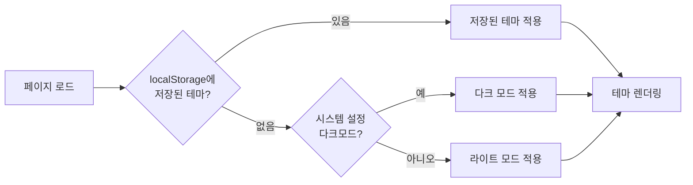

<style>
.content-cover, .screenshot-image { border: 3px solid var(--gray-200); }
</style>



{}
<i class="icon-magic"></i> **AI 요약 & 가이드**

Hugo 서택스(SeoTax) 테마에 독자의 시각적 편안함을 고려한 다크모드 전환 시스템을 구현한 과정을 다룹니다.
시스템 설정 자동 감지와 localStorage를 활용한 선호도 저장, SCSS 믹스인 기반 색상 팔레트 설계,
JavaScript 테마 전환 함수, 그리고 Disqus 댓글 색상 동기화 문제 해결까지 설명합니다.

- **[다크모드 설계 전략](#다크모드-어떻게-만들까)**: localStorage → prefers-color-scheme → 기본값 순서의 테마 우선순위 설계
- **[색상 팔레트 설계](#색상-팔레트-설계하기)**: SCSS 믹스인, CSS Variables, data-theme 속성 기반 테마 전환 시스템
- **[테마 전환 시스템 구현](#테마-전환-시스템-구현하기)**: JavaScript로 테마 속성 변경, localStorage 상태 저장, 토글 버튼/단축키 이벤트 처리
- **[Disqus 연동 문제 해결](#disqus-다크모드-동기화)**: 테마 전환 시 Disqus 댓글 위젯 색상이 변경되지 않는 문제에 대한 해결책
{}

다크모드를 선호하는 저에게 있어서 Hugo 서택스(SeoTax) 테마의 다크모드는
그 어떠한 블로그 독자들보다도 더욱 필요한 기능입니다.

서택스 테마의 색상 조합은 단순한 편이기 때문에 다크모드의 구현 자체는 어렵지 않았지만,
다크모드 ON/OFF 이벤트를 발생시키고 이러한 이벤트로 테마 색상이 전환되었을 때
외부 위젯의 색상도 같이 변경시키는데 애로 사항이 있었습니다.



## 왜 다크모드가 필요할까?

다크모드는 단순히 "검은 배경"이 아닙니다.
독자의 시각적 편안함과 접근성을 동시에 고려한 사용자 경험(UX) 설계입니다.

{}
1. **눈 피로 감소**: 밝은 배경의 블루라이트 노출을 줄여 장시간 독서 시 눈의 부담 완화
2. **독자 선호도 반영**: 최근 대부분의 OS와 앱이 다크모드를 지원하며, 많은 사용자가 선호
3. **야간 가독성 향상**: 어두운 환경에서 밝은 화면보다 낮은 밝기로 콘텐츠 소비 가능
4. **에너지 절약**: OLED 디스플레이에서 검은 픽셀은 전력 소모가 적음
{}

서택스 테마의 전신인 Hugo Book 테마도 다크모드를 지원하지만, 몇 가지 개선이 필요했습니다.
- 토글 버튼이 없어 사용자가 라이트/다크 모드 전환 불가
- 만약 사용자가 라이트/다크 모드를 전환할 수 있더라도 재방문 시 유지되지 않음
- 다크모드 색상이 전반적으로 회색에 가까워 개인적인 선호와 맞지 않음



## 다크모드, 어떻게 만들까?

### 다크모드 설계 방향

서택스 테마의 다크모드는 다음 4가지 핵심 기능을 중심으로 설계했습니다.

{}
1. **시스템 설정 자동 감지**: `prefers-color-scheme` 미디어 쿼리로 OS나 브라우저의 다크모드 설정을 감지
2. **localStorage 저장**: 독자가 선택한 테마를 브라우저에 저장하여 재방문 시에도 유지
3. **다크모드 토글 버튼**: 사이드 메뉴에 직관적인 다크모드 전환 버튼 추가
4. **키보드 단축키 지원**: `Cmd/Ctrl + Shift + S` 단축키로 빠른 테마 전환 지원
{}

### 테마 전환 우선순위

독자의 선호도를 최대한 존중하기 위해 다음과 같은 우선순위를 설정했습니다.



1. **localStorage**: 독자가 이전에 선택한 테마가 있으면 최우선적으로 반영
2. **시스템 설정**: 독자가 블로그에 처음 방문했거나 테마를 변경하지 않았다면 OS나 브라우저의 선호를 따름
3. **기본값 - 라이트 모드**: 시스템 설정도 없다면 기본값인 라이트 모드 적용

## 색상 팔레트 설계하기

다크모드의 핵심은 **색상 설계**입니다.
단순히 배경을 검정, 글자를 흰색으로 반전시키면 오히려 눈이 더 피로할 수 있습니다.

### SCSS 변수와 믹스인(@mixin)

서택스 테마는 CSS Variables(Custom Properties)와 SCSS 믹스인을 결합하여
테마별 색상 팔레트를 관리합니다.

{}
```scss
@mixin theme-light {
  --gray-100: #f8f9fa;
  --gray-200: #e9ecef;
  --gray-300: #c7cfd3;
  --gray-500: #6f767e;
  --gray-800: #495057;

  --color-link: #0055bb;
  --color-visited-link: #5500bb;
  
  --body-background: white;
  --body-font-color: black;
  
  --toc-font-color: black;
  --toc-active-color: black;
  
  --icon-filter: none;
  --box-shadow: rgba(0, 0, 0, 0.1);
}
```
<--->
```scss
@mixin theme-dark {
  --gray-100: #23272a;
  --gray-200: #2d3339;
  --gray-300: #3d444a;
  --gray-500: #6c757d;
  --gray-800: #adb5bd;

  --color-link: #8ecfff;
  --color-visited-link: #a7aaff;
  
  --body-background: #181a1b;
  --body-font-color: #f5f6fa;
  
  --toc-font-color: #acacac;
  --toc-active-color: white;
  
  --icon-filter: brightness(0) invert(1);
  --box-shadow: rgba(255, 255, 255, 0.1);
}
```
{}

대표적으로 다음과 같은 색상에 대해 다크모드 색상을 선정한 이유가 있습니다.
- **배경색**:
  순수 검정(<span style="background: #000; color: #fff;">#000</span>) 대신
  어두운 회색(<span style="background: #181a1b; color: #fff;">#181a1b</span>) 사용 → 눈의 피로 감소
- **글자색**:
  순수 흰색(<span style="background: #000; color: #fff;">#fff</span>) 대신
  밝은 회색(<span style="background: #000; color: #f5f6fa;">#f5f6fa</span>) 사용 → 대비 완화
- **링크색**:
  파란색 계열 유지하되 밝기 조정
  (<span style="background: #0055bb; color: #fff;">#0055bb</span> →
  <span style="background: #8ecfff; color: #000;">#8ecfff</span>)
- **아이콘**:
  `invert(1)` 함수로 다크모드에서 아이콘 색상 반전
  (<i class="icon-folder" style="background: #fff; color: #000;"></i> →
  <i class="icon-folder" style="background: #181a1b; color: #fff;"></i>)

### 속성 값에 따른 테마 전환

`assets/css/variables/_colors.scss` 파일에 정의된 위 믹스인은
`assets/css/themes/_auto.scss` 파일에서 다음과 같이 호출됩니다.
`:root` 가 가리키는 최상위 요소 `<html>` 의 `data-theme` 속성 값에 따라
라이트 또는 다크모드의 믹스인이 적용됩니다.

```scss
:root {
  @include theme-light; // 기본값 - 라이트 모드
}

// data-theme 속성에 따라 테마 전환
[data-theme="dark"] {
  @include theme-dark;
}

[data-theme="light"] {
  @include theme-light;
}

// data-theme 속성이 없으면 시스템 설정을 따름
@media (prefers-color-scheme: dark) {
  :root:not([data-theme]) {
    @include theme-dark;
  }
}
```

이 방식의 가장 큰 장점은 JavaScript로 `<html>` 요소의 `data-theme` 속성
하나만 변경하면 블로그의 모든 색상이 CSS Selector에 의해 제어되어 즉시 변경된다는 점입니다.
이것은 JavaScript로 요소 하나하나의 스타일을 변경하는 것과 비교하여 오버헤드가 매우 적고,
CSS Selector만으로 모드별 커스터마이징이 가능해진다는 이점을 가집니다.

예시를 하나 제공드리자면, 다음과 같은 CSS 설정이 있습니다.

```scss
.mermaid {
  [data-theme="dark"] & {
    .edgePath .path {
      stroke: #e0e0e0 !important;
    }
    ...
  }
}
```

이 설정은 앞선 문단 [테마 전환 우선순위](#테마-전환-우선순위)에서 그려진
Mermaid 그래프에 적용되는 스타일인데, 라이트모드 중심으로 설계된 Mermaid 그래프를 다크모드에서 봤을 때
검은색의 엣지(화살표)가 보이지 않는 문제를 해결하기 위한 설정입니다.
`data-theme` 속성 값이 `dark` 인 경우에 한해
밝은 회색(<span style="background: #e0e0e0; color: #000;">#e0e0e0</span>)의
화살표로 보이게끔 설정하여 이 문제를 간단하게 해결할 수 있었습니다.

## 테마 전환 시스템 구현하기

### JavaScript 테마 전환 로직

서택스 테마에서 `set-theme.js` 리소스는 다크모드 전환의 핵심 로직을 담당합니다.
특히, 해당 리소스의 `setTheme()` 함수가 다크모드 전환을 직접적으로 수행하는데,
EventListener를 통해 DOM이 로딩되는 시점에 해당 함수가 자동으로 호출됩니다.

```js
// themes/seotax/assets/js/core/set-theme.js

/**
 * @param {'dark'|'light'} name
 */
function setTheme(name) {
  const root = document.documentElement;
  root.setAttribute('data-theme', name);
  localStorage.setItem(storageKey, name);
}
```

### 독자가 선호하는 테마 감지

[테마 전환 우선순위](#테마-전환-우선순위)에 따라 localStorage에 저장된 테마 설정이 우선되고,
localStorage에 내역이 없다면 `window.matchMedia()` 메서드를 활용하여
`prefers-color-scheme` 미디어 쿼리에서 독자가 다크모드를 선호하는지 감지합니다.

```js
/**
 * @returns {'dark'|'light'}
 */
function getPreferredTheme() {
  const saved = localStorage.getItem(storageKey);
  if (saved === 'dark') {
    return 'dark';
  } else if (saved === 'light') {
    return 'light';
  } else {
    const isDark = window.matchMedia('(prefers-color-scheme: dark)').matches;
    return (isDark ? 'dark' : 'light');
  }
}
```

이 함수의 실행 결과는 `setTheme(name)` 함수의 `name` 매개변수로 전달되어
초기에 라이트모드로 설정할지, 또는 다크모드로 설정할지가 결정됩니다.

### 다크모드 토글 버튼 추가

독자의 선호에 맞춰서 라이트/다크 모드를 설정한데서 그치지 않고
독자가 직접 테마를 변경할 수 있게 토글 버튼을 지원합니다.

토글 버튼의 위치는 사이드 메뉴가 적절하다고 판단하여 다음과 같은 `<button>` 요소를 추가했습니다.



{}
```html
<!-- layouts/_partials/menu/links.html -->

<div class="menu-links">
  ...
  <button class="dark-mode-toggle" id="theme-toggle-button" 
          aria-label="Toggle color scheme">
    <i class="icon-moon"></i>
  </button>
</div>
```
{}

{}
```scss
// assets/css/_layouts.scss

.dark-mode-toggle {
  margin-top: 1rem;
  background: none;
  border: none;
  cursor: pointer;
  font-size: 1.5rem;
  color: inherit;
  transition: color 0.2s;
}

[data-theme="dark"] .dark-mode-toggle {
  color: #ffe066;  // 다크 모드에서 노란색으로 강조
}
```
{}



서택스 테마는 IcoMoon 서비스를 활용하여 `icon-moon` 에 대응되는
<i class="icon-moon"></i> 아이콘을 다크모드 토글 버튼으로 사용했습니다.   

Font Awesome CDN을 사용하신다면 `circle-half-stroke` 아이콘을 추천합니다.
IcoMoon 서비스에서는 이 아이콘을 찾을 수 없어 위 달 모양의 아이콘으로 대체했습니다.

### 토클 버튼 클릭 이벤트 등록

토글 버튼을 클릭하면 `toggleDarkMode()` 함수가 호출되어 테마를 반전시킵니다.

토글 버튼을 클릭하는 이벤트는, 반드시 페이지 로딩 후 독자가 선호하는 테마가 적용된 이후
발생할 것이기 때문에, `data-theme` 속성이 있음을 전제로 진행됩니다.
`<html>` 요소에서 `data-theme` 속성을 읽어서 `dark` 라면 `light` 로,
`light` 라면 `dark` 로 전환하는 단순한 동작을 합니다.

```js
const toggleBtn = document.querySelector('#theme-toggle-button');

function toggleDarkMode() {
  const isDark = (document.documentElement.getAttribute('data-theme') === 'dark');
  setTheme(isDark ? 'light' : 'dark');
  ...
}

if (toggleBtn) {
  toggleBtn.addEventListener('click', toggleDarkMode);
}
```

### 단축키 이벤트 등록

사이드 메뉴가 좌측에 있다보니 오른손 잡이에겐 버튼을 클릭하기 조차 귀찮을 수도 있습니다.

이런 사용자를 위해 단축키도 설정했습니다.
`Cmd/Ctrl + Shift + S` 단축키로 테마를 전환할 수 있으며,
해당 단축키를 클릭하면 마찬가지로 `toggleDarkMode()` 함수가 호출됩니다.

```js
document.addEventListener('keydown', function(e) {
  if ((e.metaKey || e.ctrlKey) && e.shiftKey && e.key === 's') {
    e.preventDefault();
    toggleDarkMode();
  }
});
```

## Disqus 다크모드 동기화

Disqus 댓글 위젯은 `iframe` 으로 로드되기 때문에
테마 전환 시 자동으로 색상이 변경되지 않습니다.

이 문제를 해결하려면 Disqus를 강제로 리로드해야 합니다.



### Disqus 리로드 함수

`window.reloadDisqus()` 함수는 Disqus 설정을 초기화하는 동작을 합니다.
`reset()` 을 호출할 때 Disqus 테마를 직접 지정할 수도 있지만, 이를 생략하고
Disqus가 블로그의 Color Scheme을 읽어서 어울리는 색상을 구성하게 하는 편이 더 자연스럽습니다.

```js
window.reloadDisqus = function() {
  if (window.DISQUS) {
    DISQUS.reset({
      reload: true,
      config: function() {
        this.page.url = '{{ .Permalink }}';
        this.page.identifier = '{{ .Permalink }}';
      }
    });
  }
};
```

### 테마 전환 시 리로드 함수 호출

`window.reloadDisqus()` 함수는 `set-theme.js` 리소스에서
`toggleDarkMode()` 함수가 호출될 때 같이 실행됩니다.

```js
function toggleDarkMode() {
  const isDark = (document.documentElement.getAttribute('data-theme') === 'dark');
  setTheme(isDark ? 'light' : 'dark');

  // Disqus 댓글 색상 동기화
  if (window.DISQUS && typeof window.reloadDisqus === 'function') {
    window.reloadDisqus();
  }
}
```

여기까지 설정했다면 테마에 맞춰서 Disqus 댓글 위젯 색상도 맞춰서 변경됩니다.
단점이라고 한다면, 라이트/다크 모드를 전환할 때마다 Disqus 댓글 위젯이 리로드되기 때문에
매번 위젯을 구성하기 위해 약간의 지연이 발생합니다.



## 다음 글 예고

이번 다크모드 구현 과정에서 코드블럭과 관련된 색상 팔레트 등의 설명은 일부러 생략했습니다.


다음 글에서 코드블럭에 Mac 스타일을 적용하고 코드 내용 복사 버튼을 구현한 과정을
안내할 예정이며, `highlight.js` 에서 가져온 코드블럭의 색상 팔레트도 공유드리겠습니다.

마치며, CSS 스타일과 JavaScript의 동적 제어를 적절히 활용하면 독자들에게 더 나은 시각적 경험을 제공할 수 있습니다.
여러분의 Hugo 블로그에도 이러한 다크모드 시스템을 적용해보시기 바랍니다.
