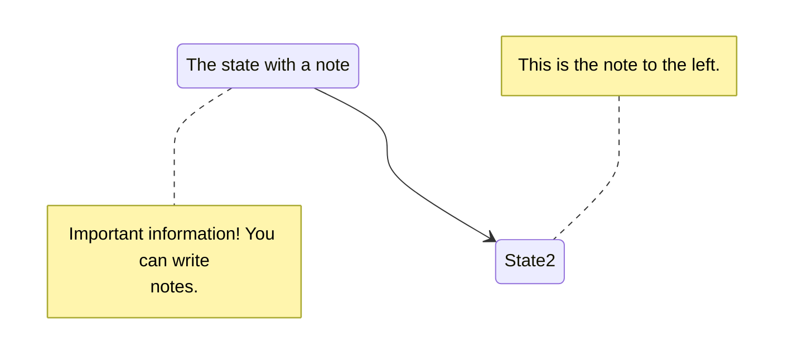

<style>
.screenshot-image { border: 3px solid var(--gray-200); }
.markdown .data-table-desc table { margin-top: 0; }
.markdown .data-table-desc td { width: fit-content; max-width: none; text-overflow: none; }
</style>



{}
<i class="icon-magic"></i> **AI 요약 & 가이드**

Hugo Shortcodes는 마크다운 어디서든 `` 한 줄 호출로 복잡한 HTML 컴포넌트를 삽입하는 기능입니다.
이 글에서는 Hugo 내장 Shortcodes부터 Hugo Book 테마, 그리고 서택스 테마에서 직접 만든 북마크, 테이블, 시리즈 Shortcodes를
실제 실행 결과와 함께 보여드립니다.

- **[Shortcodes 호출 방식](#shortcodes-호출-방식)**: ``와 `{}` 가 왜 다른지, 언제 어떤 방식을 써야 하는지
- **[Bookmark](#bookmark)**: URL 하나만 넘기면 OG 메타데이터를 자동 파싱해 링크 카드를 완성하는 Shortcode
- **[Data-Table](#data-table)**: CSV 텍스트를 그대로 붙여넣으면 헤더 및 다운로드 버튼을 갖춘 테이블로 렌더링
- **[Image](#image)**: 크기 조절, 캡션, 클릭 시 확대까지 지원하는 커스텀 이미지 Shortcode
- **[Series](#series)**: Velog 스타일로 시리즈 글 목록을 빌드 시점에 자동 생성하는 Shortcode
{}

Github 블로그의 장점은 마크다운에서 HTML, CSS, JavaScript를 자유롭게 활용하여
마크다운의 한계를 넘어선 다양한 요소들을 추가할 수 있다는 것입니다.
만약 링크를 시각적으로 눈에 띄게 보이고 싶다면 `<a>` 태그와 CSS 스타일을 조합하여
북마크 카드 형태로 표현할 수 있고, `<input>` 과 `<label>` 태그를 조합하여
세로로 긴 내용을 탭 UI로 구분하여 표시할 수도 있습니다.

하지만, 일부 요소는 여러 개의 글에서 공통적으로 사용되는데
그 때마다 HTML 코드를 복사해 붙여넣는 것은 불편하기도 하고,
만약 코드가 길다면 가독성 면에서도 떨어집니다.
그리고, 만약 이러한 요소를 바꿔야 한다면 모든 글을 찾아가 하나씩 코드를 바꿔줘야 할 것입니다.

Hugo는 이 문제를 **Shortcodes**라는 기능으로 해결합니다.
이 글에서는 Shortcodes가 무엇인지 설명하고,
서택스(SeoTax) 테마에서 사용하는 커스텀 Shortcodes를 소개합니다.

## Shortcodes

Hugo Shortcodes는 마크다운 본문에서 `` 형식으로 호출할 수 있는
**재사용 가능한 HTML 컴포넌트 템플릿**입니다.

Hugo의 Shortcodes는 단순히 고정된 HTML 코드를 재사용하는데서 그치지 않습니다.
템플릿 내에서 Hugo 문법을 사용할 수 있기 때문에, 매개변수를 전달받아
일부 텍스트 또는 일부 속성을 변경하여 같은 Shortcodes를 호출해도
다른 결과를 만들어낼 수 있습니다.

Hugo는 공식적으로 몇 가지 내장 Shortcodes를 제공하며 (`figure`, `youtube`, `gist` 등),
테마의 `layouts/_shortcodes/` 경로에 `.html` 파일을 추가하여
커스텀 Shortcodes를 만들 수도 있습니다.



### Shortcodes 호출 방식

Shortcodes를 마크다운에서 호출하는 방식은 두 가지가 있습니다.

**1. 꺾쇠 괄호 방식** ``: 내부 컨텐츠를 그대로 전달합니다.

```go-html

**굵게** 표시됩니다.

```


**굵게** 표시됩니다.


꺾쇠 괄호 방식으로 호출하면 내부 컨텐츠를 전부 텍스트로 처리합니다.
마크다운 렌더링이 필요한 경우 다음의 퍼센트 방식을 사용해야 합니다.

**2. 퍼센트 방식** `{{\% ... \%}}`: 내부 컨텐츠를 마크다운으로 파싱한 후 전달합니다.

```go-html
{}
**굵게** 표시됩니다.
{}
```

{}
**굵게** 표시됩니다.
{}

내부 컨텐츠가 없는 단독 Shortcode라면 두 방식의 차이가 없습니다.
내부에 마크다운을 작성해야 한다면 퍼센트 방식을, HTML을 직접 넣거나 다른 Shortcode를 중첩할 때는
꺾쇠 괄호 방식을 사용하는 것이 일반적입니다.

### 파라미터 전달 방법

Shortcode에 값을 전달하는 방법도 두 가지가 있습니다.

```go-html
         {{/* 위치 기반 파라미터 */}}
     {{/* 이름 기반 파라미터 */}}
```

Shortcode 템플릿 안에서는 각각 `.Get 0`, `.Get "url"` 로 값을 꺼냅니다.
두 방식을 섞어서 사용할 수도 있습니다.

## Hugo 내장 Shortcodes

Hugo에서 미리 정의하여 제공하는 Shortcodes를 몇 가지 소개합니다.

### Details

`Details` Shortcode는 HTML의 `<details>` 요소를 그대로 호출합니다.

자세한 내용을 요약해 표시하고 독자가 직접 펼쳐서 세부 내용을 보게하고 싶을 때 사용합니다.

```go-html
{}
**굵게** 표시됩니다.
{}
```

{}
**굵게** 표시됩니다.
{}

추가로 사용 가능한 인자는 Hugo 공식 문서
[Details shortcode](https://gohugo.io/shortcodes/details/) 를
참고해주세요.

### X (Twitter)

소셜 미디어 X에 대한 임베딩을 Shortcode로 제공합니다.
(X Shortcode를 덮어쓰고 싶으시다면
[소스코드](https://github.com/gohugoio/hugo/blob/master/tpl/tplimpl/embedded/templates/_shortcodes/x.html)를
참고해주세요.)

`<iframe>` 으로 외부 컨텐츠를 가져오기 때문에 JavaScript로 조작하지 않는 한
다크 모드 전용 어두운 스타일을 적용하기 어렵고,
제가 사용할 일도 없어서 다크 모드에서도 하얀색 배경으로 보이는 건 양해바랍니다.

```go-html
<!-- https://x.com/github/status/2017704478045008103 주소로부터 user, id 추출 -->

```


비슷하게 인스타그램에 대한 임베딩으로 `instagram` Shortcode도 있습니다.

### Youtube

유튜브 또한 Shortcode로 임베딩을 제공합니다.
(Youtube Shortcode를 덮어쓰고 싶으시다면
[소스코드](https://github.com/gohugoio/hugo/blob/master/tpl/tplimpl/embedded/templates/_shortcodes/youtube.html)를
참고해주세요.)

```go-html
<!-- https://www.youtube.com/watch?v=0RKpf3rK57I 주소로부터  -->

```



## Hugo Book Shortcodes

서택스 테마는 Hugo Book 테마로부터 파생되었습니다.
따라서, Hugo Book 테마에서 지원하는 Shortcodes를 지원합니다.

Hugo Book에서 지원하는 전체 Shortcodes는 Exameple Site의 Shortcodes 문서들을 참고해주시기 바랍니다.



### Columns

[Columns Shortcode](https://hugo-book-demo.netlify.app/docs/shortcodes/columns/)는
짧은 콘텐츠의 가독성을 높이기 위해 가로로 배열하고 싶을 때 사용합니다.
Hugo Book 테마에서는 마크다운 리스트 표현으로 각 열을 구분하도록 권장하지만,
저는 `<--->` 구분자로 열을 구분하는 방식을 선호합니다.

`ratio` 인자를 선택적으로 줄 수 있는데, 이 값은 `flex-grow` 속성 값으로 사용되어
각 컨텐츠의 가로 비율을 결정합니다.

```go-html
{}
- ### Left Content
  Lorem markdownum insigne...

- ### Mid Content
  Lorem markdownum insigne...

- ### Right Content
  Lorem markdownum insigne...
{}
```

{}
- #### Left Content
  Lorem markdownum insigne...

- #### Mid Content
  Lorem markdownum insigne...

- #### Right Content
  Lorem markdownum insigne...
{}

### Hints

[Hint Shortcode](https://hugo-book-demo.netlify.app/docs/shortcodes/hints/)는
특정 내용을 감싸서 배경색으로 강조하고 싶을 때 사용합니다.

이 글의 상단에도 **AI 요약 & 가이드**라는 파란색 Hint 영역이 있습니다.

```
{}
이 안에 **강조할 내용**을 작성합니다.
{}
```

첫 번째 파라미터로 스타일을 지정합니다.

`info`, `success`, `warning`, `danger` 네 가지를 지원하며,
값을 생략하면 기본 스타일이 적용됩니다.

{}
기본 스타일 - `blockquote` 요소와 동일합니다.
{}

{}
`info` 스타일 - 파란색 계열로 표시됩니다.
{}

{}
`success` 스타일 - 초록색 계열로 표시됩니다.
{}

{}
`warning` 스타일 - 노란색 계열로 표시됩니다.
{}

{}
`danger` 스타일 - 빨간색 계열로 표시됩니다.
{}

Hint Shortcode는 `blockquote` 요소이며, 스타일로 전달되는 인자는 클래스로 추가됩니다.
덕분에 라이트 모드와 다크 모드에서 각각 다른 CSS 색상 스타일을 적용할 수 있습니다.

### Mermaid

[Mermaid Shortcode](https://hugo-book-demo.netlify.app/docs/shortcodes/mermaid/)를
사용하면 Mermaid 차트와 다이어그램을 그릴 수 있습니다.

Mermaid는 코드블럭처럼 백틱(```)으로 감싸서 호출합니다.

````text

````


Mermaid와 함께, 수식 표현을 할 수 있는 Katex도 지원합니다.
마찬가지로 코드블럭처럼 호출할 수 있습니다.

### Tabs

[Tabs Shortcode](https://hugo-book-demo.netlify.app/docs/shortcodes/tabs/)는
같은 맥락의 컨텐츠들을 탭 UI로 나눠서 보여주고 싶을 때 사용합니다.

Tabs Shortcode는 Tab Shortcode와 세트로 사용되는데,
각각의 컨텐츠를 `tab` 으로 감싸고 여러 개의 `tab` 을 `tabs` 로 감쌉니다.

```go-html

{} # MacOS Content {}
{} # Linux Content {}
{} # Windows Content {}

```



{}
#### MacOS

This is tab **MacOS** content.

Lorem markdownum insigne. Olympo signis Delphis! Retexi Nereius nova develat
stringit, frustra Saturnius uteroque inter! Oculis non ritibus Telethusa
protulit, sed sed aere valvis inhaesuro Pallas animam: qui _quid_, ignes.
Miseratus fonte Ditis conubia.
{}

{}
#### Linux

This is tab **Linux** content.

Lorem markdownum insigne. Olympo signis Delphis! Retexi Nereius nova develat
stringit, frustra Saturnius uteroque inter! Oculis non ritibus Telethusa
protulit, sed sed aere valvis inhaesuro Pallas animam: qui _quid_, ignes.
Miseratus fonte Ditis conubia.
{}

{}
#### Windows

This is tab **Windows** content.

Lorem markdownum insigne. Olympo signis Delphis! Retexi Nereius nova develat
stringit, frustra Saturnius uteroque inter! Oculis non ritibus Telethusa
protulit, sed sed aere valvis inhaesuro Pallas animam: qui _quid_, ignes.
Miseratus fonte Ditis conubia.
{}



저는 주로 웹 페이지를 설명할 때 HTML, CSS, JavaScript 코드를
Tab UI로 나눠서 보여주는 용도로 해당 Shortcode를 사용했습니다.

## 서택스 테마 Shortcodes

이제부터는 서택스 테마를 개발하면서 제가 만든 Shortcodes를 설명드립니다.

서택스 테마를 사용하시면 다음과 같은 편리한 Shortcodes를 이용할 수 있습니다.

### Bookmark

**Bookmark** Shortcode는 URL을 인자로 전달하면
대상 웹사이트로부터 OG(Open Graph) 메타데이터를 가져와 카드 형태로 표시합니다.

```

```



URL을 전달하면 Hugo 빌드 시점에 해당 페이지에서 `og:title`, `og:description`, `og:image`,
`og:site_name` 태그를 파싱하여 카드 형태의 북마크를 구성합니다. 만약 해당 메타태그가 없다면
`<title>`, `description`, `` 등 대안을 탐색합니다.

메타데이터를 직접 지정하여 빌드 시간을 절약하고 싶다면 `fetch="false"`
매개변수를 주어서 메타태그 파싱을 위한 URL 요청을 생략할 수 있습니다.
URL 요청을 생략할 경우 `title`, `description`, `image` 매개변수를 전달해
메타데이터를 선택적으로 채울 수 있습니다.

```go-html

```

`fetch="true"` 인 경우라도, 메타데이터를 파싱할 수 없는 경우
`title`, `description`, `image` 매개변수 값을 기본값으로 활용할 수 있습니다.
반대로, URL에 대한 메타데이터가 특정된다면 매개변수로 전달한 값은 무시됩니다.

Bookmark Shortcode를 구성하는 소스코드에 관심 있으시면
[Github 링크](https://github.com/minyeamer/hugo-seotax/blob/main/layouts/_shortcodes/bookmark.html)를
확인해주시기 바랍니다. Hugo 함수인
[`resources.GetRemote`](https://gohugo.io/functions/resources/getremote/) 를
호출하여 HTTP GET 요청을 보내고 정규 표현식으로 메타데이터를 파싱하는 동작이 구현되어 있습니다.

### Data-Table

**Data-Table** Shortcode는 마크다운의 기본 표를 대신해 스타일이 적용된 테이블을 표시합니다.
저는 데이터를 다루는 설명 글에서 CSV 데이터를 공유하기 위한 목적으로 이러한 Shortcode를 만들었습니다.

Data-Table은 헤더, 짝수 행, 홀수 행에 각각 다른 배경색 스타일이 적용되고
선택적으로 다운로드 버튼을 표시할 수 있습니다.

```go-html

이름,나이,점수,등급
홍길동,30,95,A
김철수,25,80,B

```


이름,나이,점수,등급
홍길동,30,95,A
김철수,25,80,B


Data-Table Shortcode에는 다음과 같은 매개변수를 전달할 수 있습니다.

{}
매개변수|설명
`delimiter`|텍스트를 구분하는 문자입니다. 생략 시 `","` 가 적용됩니다.
`align-center`|열 번호(1 시작)를 쉼표(,)로 연결된 문자열로 전달합니다.<br>해당하는 열은 `text-align: center;` 스타일이 적용됩니다.
`class`|`<table>` 요소를 감싸는 `<div>` 요소에 클래스를 추가할 수 있습니다.
`file-name`|`data-filename` 속성에 들어가는 파일명이며,<br>값이 있으면 다운로드 버튼을 표시합니다.
`enable-download`|파일명이 있을 경우에 다운로드 버튼을 표시할지 여부이며,<br>생략 시 `"true"` 가 적용됩니다.
`headers`|헤더가 여러 개인 경우 헤더 스타일을 적용할 행 개수를 전달합니다.
{}

Data-Table Shortcode를 구성하는 소스코드에 관심 있으시면
[Github 링크](https://github.com/minyeamer/hugo-seotax/blob/main/layouts/_shortcodes/data-table.html)를
확인해주시기 바랍니다.

### Image

**Image** Shortcode는 마크다운의 기본 이미지 `` 를 대신해
이미지의 너비, 최대 너비, 정렬, 바로가기 링크, 캡션 등을 매개변수로 편리하게 적용할 수 있는 기능을 제공합니다.

저는 주로 100% 너비로 표시하기에는 너무 큰 이미지들에 최대 너비와 가운데 정렬을 적용하는데,
HTML 코드를 직접 작성하는 대신 다음과 같이 Shortcode를 호출합니다.

```

```



Image Shortcode에는 다음과 같은 매개변수를 전달할 수 있습니다.

{}
매개변수|설명
`alt`|`alt` 속성에 들어가는 이미지 설명입니다.
`caption`|이미지 하단에 캡션을 표시합니다.
`class`|`` 요소를 감싸는 `<div>` 요소에 클래스를 추가할 수 있습니다.
`title`|`title` 속성에 들어가는 이미지 툴팁입니다.
`loading`|`loading` 속성에 들어가는 값이며, 생략 시 지연 로딩(Lazy Loading)이 적용됩니다.
`align`|`text-align` 속성에 들어가는 정렬 설정입니다.
`href`|이미지를 감싸는 `<a>` 태그의 `href` 속성에 들어가는 바로가기 링크입니다.
`target`|이미지를 감싸는 `<a>` 태그의 `target` 속성에 들어가는 바로가기 링크입니다.<br>생략 시 `_blank` 가 적용됩니다.
`width`|이미지의 너비 `width` 속성을 추가합니다.
`min-width`|이미지에 최소 너비 `min-width` 스타일을 적용합니다.
`max-width`|이미지에 최대 너비 `max-width` 스타일을 적용합니다.
`height`|이미지의 높이 `height` 속성을 추가합니다.
`min-height`|이미지에 최소 높이 `min-height` 스타일을 적용합니다.
`max-height`|이미지에 최대 높이 `max-height` 스타일을 적용합니다.
{}

Image Shortcode를 구성하는 소스코드에 관심 있으시면
[Github 링크](https://github.com/minyeamer/hugo-seotax/blob/main/layouts/_shortcodes/image.html)를
확인해주시기 바랍니다.

바로가기 링크가 없을 경우에 이미지 클릭 시 이미지가 뷰포트에 꽉차도록 확대합니다.
세로로 긴 모바일 레이아웃에서는 이미지를 90도 회전하여 확대합니다.
이미지를 한번 더 클릭하면 확대를 취소할 수 있습니다. 이 동작은
[JavaScript](https://github.com/minyeamer/hugo-seotax/blob/main/assets/js/shortcodes/image-zoom.js)로
제어합니다.

이미지 파일이 로컬에 있는 경우, 빌드 시점에 실제 이미지 파일을 읽어 `width` 와 `height` 를
자동으로 추출합니다. 이 값이 `` 태그에 포함되면 레이아웃 시프트(CLS)를 방지할 수 있어
Core Web Vitals 점수에 유리합니다. 관련한 내용은 다음 글에서 설명할 예정입니다.

### Series

Github 블로그로 옮겨가기 전에 Velog 플랫폼을 사용했는데
Velog에서 제공하던 Series 기능이 마음에 들어 Shortcode로 구현했습니다.

**Series** Shortcode는 호출 한 번으로 동일한 메타데이터를 갖는 글 목록을
나열하기 위한 목적으로 사용합니다.

```go-html

```

<div class="sc-series"><div class="series-bookmark"><svg width="32" height="48" fill="currentColor" viewBox="0 0 32 48" class="series-corner-image"><path fill="currentColor" d="M32 0H0v48h.163l16-16L32 47.836V0z"></path></svg></div><div class="series-header"><h2 class="series-title">새로운 시리즈 이름을 입력하세요</h2></div><input type="checkbox" class="series-toggle-input" hidden=""><div class="series-content"><ol class="series-list"></ol></div><div class="series-footer"><label for="series-toggle" class="series-toggle-label"><span class="series-toggle-icon"><i class="icon-caret-up"></i></span>
<span class="series-toggle-text-hide" data-i18n-id="series.hide.label" data-i18n-text="">숨기기</span>
<span class="series-toggle-text-show" data-i18n-id="series.show.label" data-i18n-text="">목록 보기</span></label><div class="series-nav"><span class="series-nav-info">1/0</span><div class="series-nav-buttons"><span class="series-nav-button disabled"><i class="icon-chevron-left"></i></span>
<span class="series-nav-button disabled"><i class="icon-chevron-right"></i></span></div></div></div></div>

Shortcode에 첫 번째로 전달되는 인자는 시리즈 명칭을 의미합니다.
Hugo 빌드 시점에 모든 `Page` 객체를 조회하여 인자 값인 시리즈 명칭과 일치하는 `series`
메타데이터를 갖는 `Page` 만 추출하고, 이를 목록으로 표현합니다. (참고로, 메타데이터는 front matter에 정의합니다.)

선택적으로 두 번째 인자를 전달할 수 있는데,
두 번째 인자는 시리즈 내 글 제목에서 공통적으로 제거할 문자열에 대한 패턴,
정규 표현식입니다. 만약 `Hugo -` 라는 공통된 문구로 시작하는 글 목록에서
이 문구를 제거하고 싶다면 다음과 같이 호출할 수 있습니다.

```go-html

```

시리즈 내 항목 간에 이동이 용이하도록 시리즈 상단에는 보이지 않는 `#series-anchor` 요소를 두고,
시리즈 내 링크에 해당 요소로 연결되는 앵커를 추가했습니다.
그래서, 링크를 클릭하여 다른 글로 이동해도 커버 이미지의 높이에 상관없이 시리즈가 항상 화면 최상단에 오게 됩니다.



Series Shortcode를 구성하는 소스코드에 관심 있으시면
[Github 링크](https://github.com/minyeamer/hugo-seotax/blob/main/layouts/_shortcodes/series.html)를
확인해주시기 바랍니다.

## 마치며

Hugo는 마크다운 편집기에서 스타일을 살리고 편의성을 제공하는 Shortcodes 기능을 제공합니다.

검색해보시면 제가 설명드린 Shortcodes 외에도 여러 사용자들이 만든
독창적이고 유용한 Shortcodes를 찾아보실 수 있습니다.

Shortcode를 추가하는 것도 HTML 템플릿을 만들어서 `layouts/_shortcodes/` 경로에 넣으면
모든 마크다운 파일에서 자유롭게 호출할 수 있을 정도로 간단합니다.
서택스 테마 또는 다른 Hugo 테마를 사용하신다면 해당 경로에 자신만의 Shortcode를 추가하고
직접 활용해보시기 바랍니다.

서택스 테마에서 지원하는 전체 Shortcodes는 아래 GitHub 링크에서 확인하실 수 있습니다.


